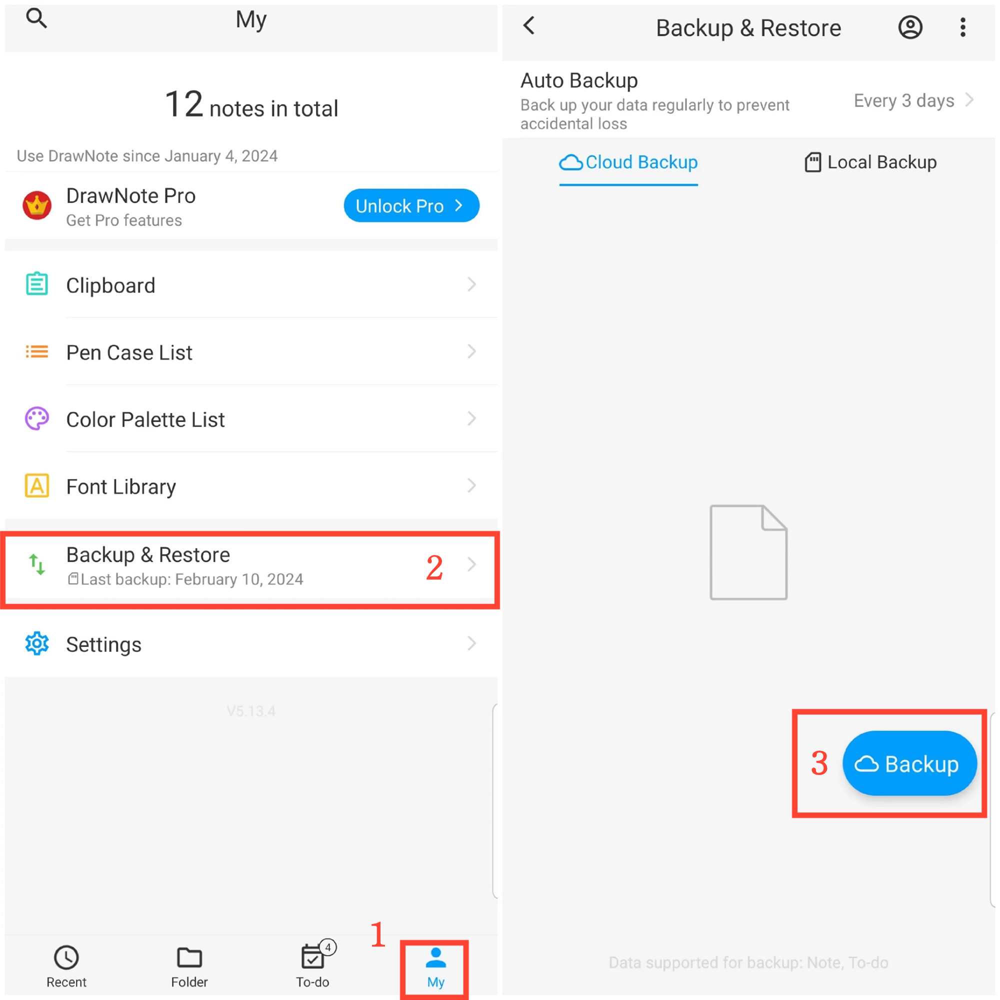

[Benutzerhandbuch](/dragonnest/drawnote/manual/de) > [Datenbackup und Wiederherstellung](/dragonnest/drawnote/manual/de/data_backup_and_recovery) >

Datenbackup
---
#### Schritte

1. Tippen Sie auf "lch" auf der Hauptseite.

2. Gehen Sie zur Option "Sichern & Wiederherstellen".

3. Klicken Sie auf "Sichern", um ein sofortiges Sichern zu starten.

