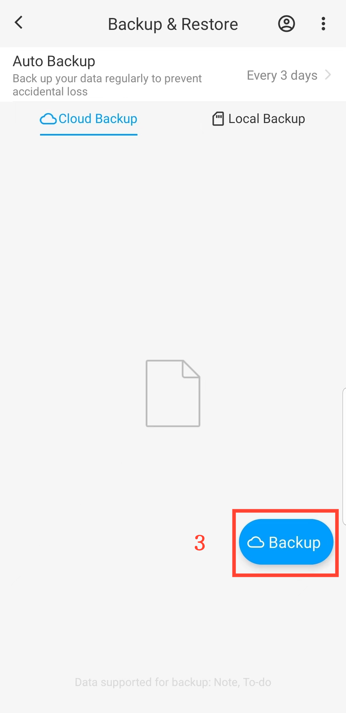

[Benutzerhandbuch](/dragonnest/drawnote/manual/de) > [Datensicherung und -wiederherstellung](/dragonnest/drawnote/manual/de/daten_sicherung_und_wiederherstellung) >

Datensicherung
---
#### Schritte

1. Tippen Sie auf der Hauptseite auf „Ich“.

2. Greifen Sie auf die Option „Sicherung & Wiederherstellen“ zu.

3. Klicken Sie auf „Sichern“, um eine sofortige Sicherung zu starten.

