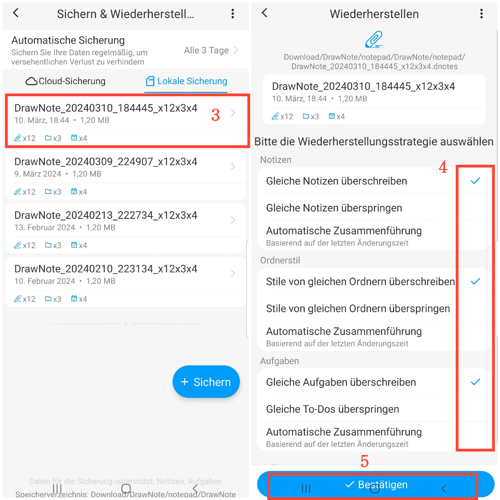

[Benutzerhandbuch](/dragonnest/drawnote/manual/de) > [Datensicherung und -wiederherstellung](/dragonnest/drawnote/manual/de/daten_sicherung_und_wiederherstellung) >

Datenwiederherstellen
---
#### Schritte

1. Tippen Sie auf der Hauptseite auf „Ich“.

2. Greifen Sie auf die Option „Sicherung & Wiederherstellen“ zu.

3. Klicken Sie auf einen Dateieintrag, um eine Sicherungsdatei auszuwählen.

4. Überprüfen Sie die entsprechenden Optionen.

5. Klicken Sie auf „Bestätigen“, um die Daten wiederherzustellen.

#### Tipps
Bei der Wiederherstellen von Sicherungsdaten gibt es drei Strategien zur Auswahl:

- Gleiche Notizen überschreiben - Ersetzen Sie die aktuellen Notizen durch den Inhalt der Sicherung.
- Gleiche Notizen überspringen - Behalten Sie die aktuellen Notizen unverändert bei, wenn der Inhalt der Sicherung gleich ist.
- Automatische Zusammenführung - Führen Sie die Sicherung und vorhandenen Notizen basierend auf der letzten Änderungszeit zusammen.

Wählen Sie die geeignete Strategie basierend auf Ihren Bedürfnissen und sichern Sie regelmäßig, um Datenverlust zu verhindern.