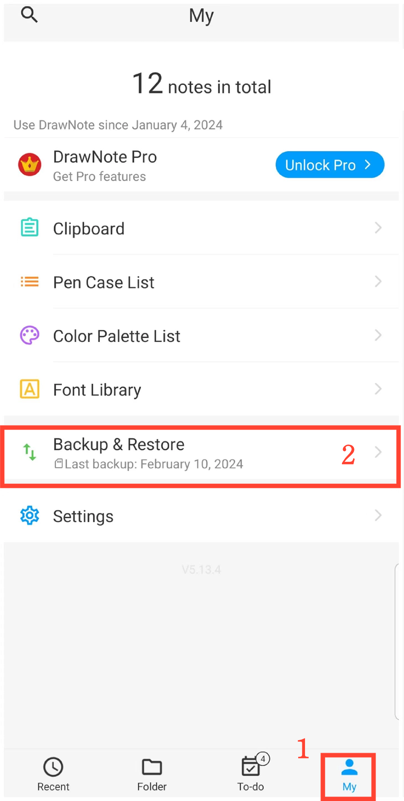

[Benutzerhandbuch](/dragonnest/drawnote/manual/de) >

Datenbackup und Wiederherstellung
---

Mit der Funktion für Datenbackup und -wiederherstellung können Sie wichtige Informationen problemlos sichern und unerwarteten Verlust vermeiden.
Sie können zwischen "Cloud-Backup" oder "Lokalem Backup" wählen.
- [Datenbackup](data_backup.md)

- [Automatisches Backup](automatic_backup.md)

- [Datenwiederherstellung](data_recovery.md)

- [Verwalten von Backup-Daten](manage_backup_data.md)

