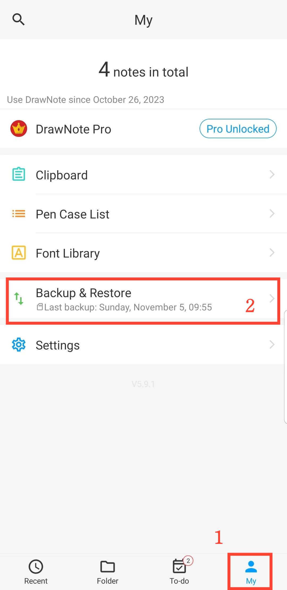

[Benutzerhandbuch](/dragonnest/drawnote/manual/de) >

Datensicherung und -wiederherstellung
---

Mit der Funktion zur Datensicherung und -wiederherstellung können Sie kritische Informationen leicht schützen und unerwarteten Verlust vermeiden.
Sie können zwischen „Cloud-Sicherung“ oder „lokaler Sicherung“ wählen.
- [Datensicherung](datensicherung.md)

- [Automatische Sicherung](automatische_sicherung.md)

- [Datenwiederherstellung](datenwiederherstellung.md)

- [Sicherungsdaten verwalten](sicherungsdaten_verwalten.md)

