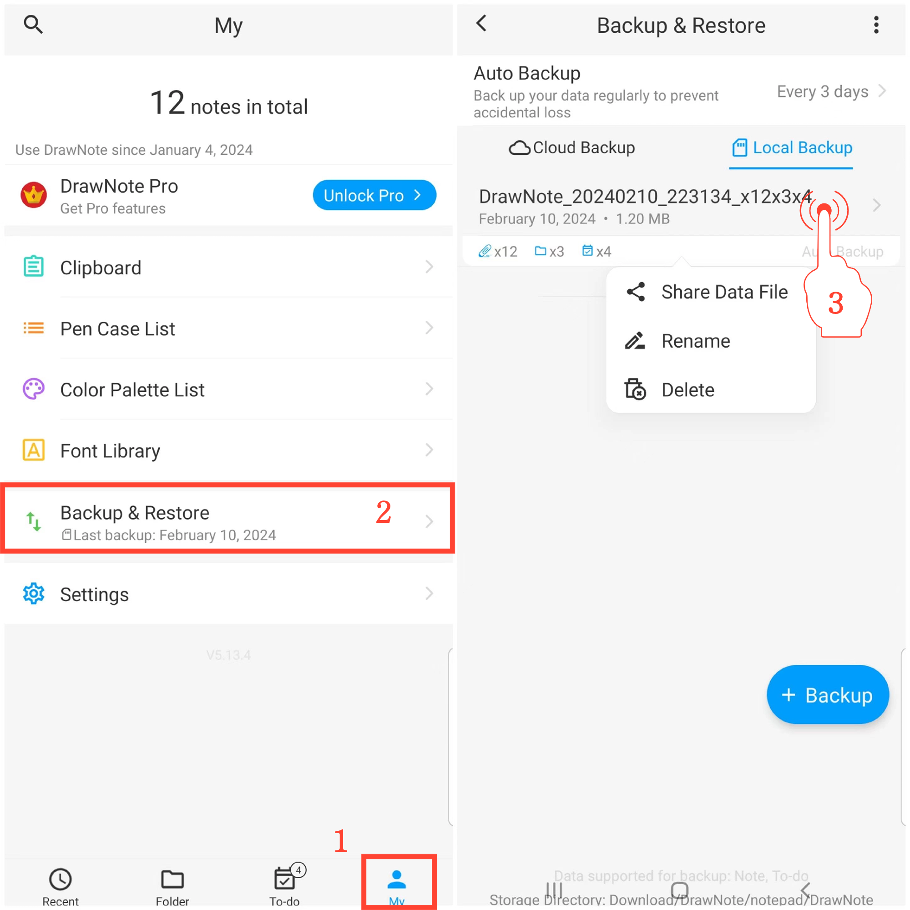

[User Manual](/dragonnest/drawnote/manual/de) > [Data Backup and Recovery](/dragonnest/drawnote/manual/de/data_backup_and_recovery) >

Verwalten von Backup-Daten
---
#### Schritte

1. Tippen Sie auf "lch" auf der Hauptseite.

2. Gehen Sie zur Option "Sichern & Wiederherstellen".

3. Drücken Sie lange auf einen Dateieintrag, um Datenwiederherstellungsobjekte zu verwalten. Sie können Freigabe-, Umbenennungs- und Löschvorgänge durchführen.

