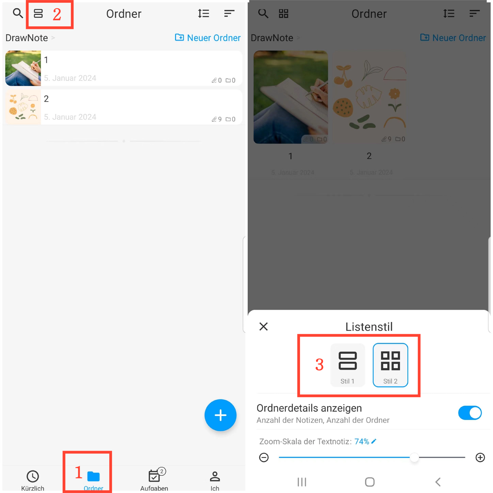

[Benutzerhandbuch](/dragonnest/drawnote/manual/de) > [Ordner](/dragonnest/drawnote/manual/de/ordner) >

Listenstil
---
#### Bedienungsschritte

1. Tippen Sie auf "Ordner" auf der Hauptseite.
2. Tippen Sie auf die Schaltfläche "Listenstil" oben links.
3. Wählen Sie einen Stil aus.

