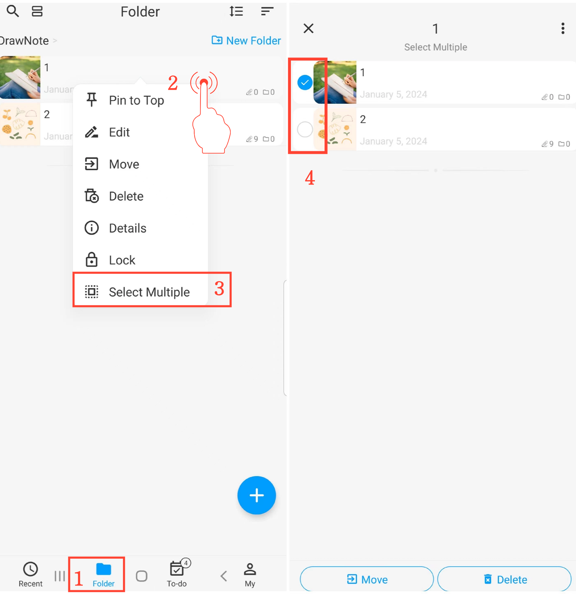

[Benutzerhandbuch](/dragonnest/drawnote/manual/de) > [Ordner](/dragonnest/drawnote/manual/de/folder) >

Mehrere Ordner oder Notizen auswählen
---

#### Bedienungsschritte
1. Tippen Sie auf "Ordner" auf der Hauptseite.
2. Drücken Sie lange auf einen Ordner oder eine Notiz.
3. Tippen Sie im Popup-Menü auf "Mehrere auswählen", um in den Mehrfachauswahlmodus zu gelangen.
4. Wählen Sie die Ordner oder Notizen aus, die Sie ändern möchten, und führen Sie dann Stapelaktionen wie Verschieben oder Löschen durch.

