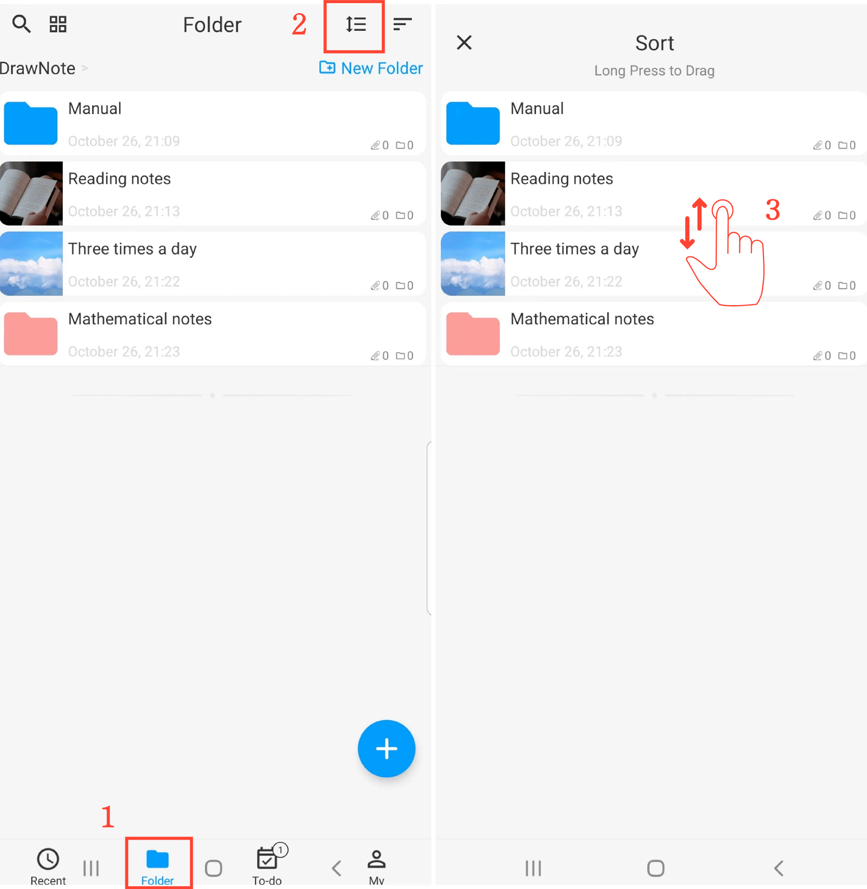

[Benutzerhandbuch](/dragonnest/drawnote/manual/en) > [Ordner](/dragonnest/drawnote/manual/en/folder) >

Ordner sortieren
---
Es gibt mehrere Möglichkeiten, Ordner zu sortieren. Sie können sie nach Name, Datum geändert, Erstellungsdatum und mehr sortieren, oder Sie können sie manuell anordnen.

#### Wählen Sie eine Sortiermethode aus
Auf der Seite "Ordner" klicken Sie auf die Schaltfläche "Sortieren nach" und wählen Ihre bevorzugte Sortiermethode aus.

#### Manuelle Sortierung
1. Auf der Seite "Ordner".

2. Klicken Sie auf die Schaltfläche "Sortieren".

3. Drücken Sie lange auf einen Ordner und ziehen Sie ihn nach oben oder unten, um die Reihenfolge anzupassen.

