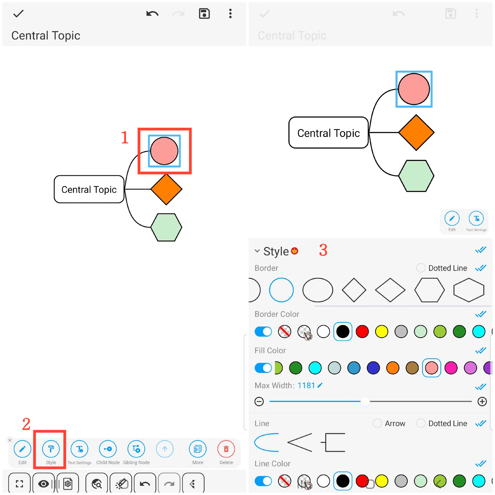
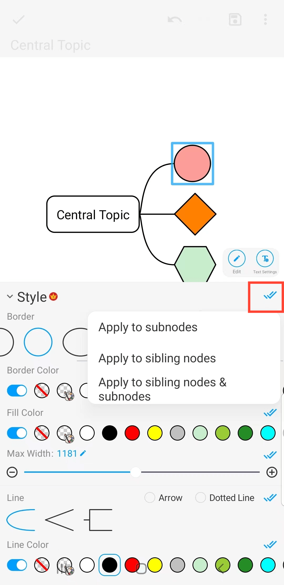

[Benutzerhandbuch](/dragonnest/drawnote/manual/de) > [Mind Mapping](/dragonnest/drawnote/manual/de/mind_mapping) >

Rahmen und Linienstile
---
#### Schritte

1. Klicken Sie auf den Knotenrahmen, den Sie festlegen möchten.

2. Klicken Sie auf die Registerkarte "Stil".

3. Wählen Sie in dem Popup-Fenster die gewünschten Stiloptionen aus, wie z. B. Rahmenform, Rahmenfarbe, Füllfarbe, Linienstil und Linienfarbe.

#### Hinweis
Klicken Sie auf die blauen doppelten Häkchen rechts. Um den Stil auf Unter- oder Geschwisterknoten oder auf Unter- und Geschwisterknoten anzuwenden.

