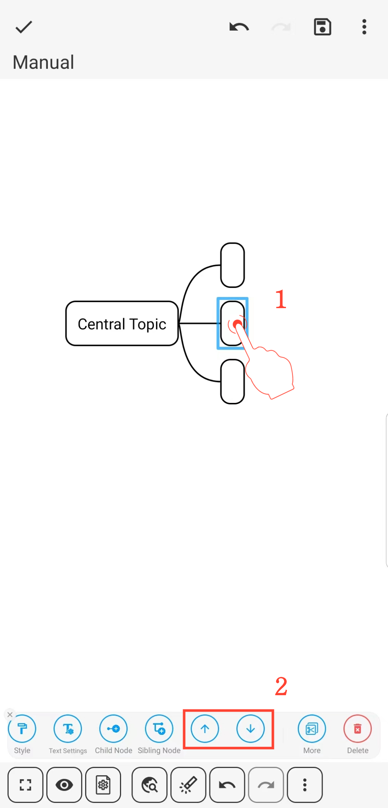

[User Manual](/dragonnest/drawnote/manual/en) > [Mind Mapping](/dragonnest/drawnote/manual/en/mind_mapping) >

Moving Node Positions
---

Es gibt zwei Methoden, um Knotenpositionen zu verschieben:

- 1. Lange drücken zum Verschieben - Wählen Sie den Knoten aus, drücken Sie lange darauf, ziehen Sie ihn an die neue Position und lassen Sie ihn los, um den Vorgang abzuschließen.

- 2. Taste zum Verschieben - Klicken Sie auf den Knoten, wählen Sie die Pfeiltaste im Menü aus und vollenden Sie die Verschiebung der Knotenposition.

