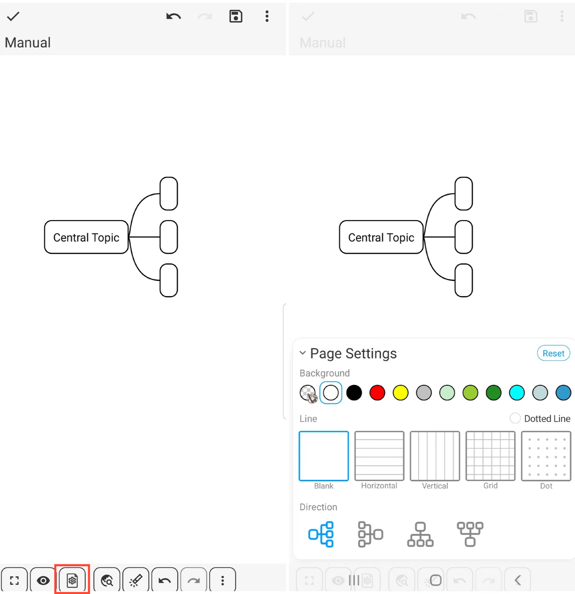

[Benutzerhandbuch](/dragonnest/drawnote/manual/en) > [Mind Mapping](/dragonnest/drawnote/manual/en/mind_mapping) >

Seiteneinstellungen
---
#### Schritte

Klicken Sie auf das Symbol "Seiteneinstellungen" in der unteren Symbolleiste, um das Menü für die Seiteneinstellungen zu öffnen, wo Sie den Hintergrund der Seite, den Mind-Mapping-Stil und mehr anpassen können.

