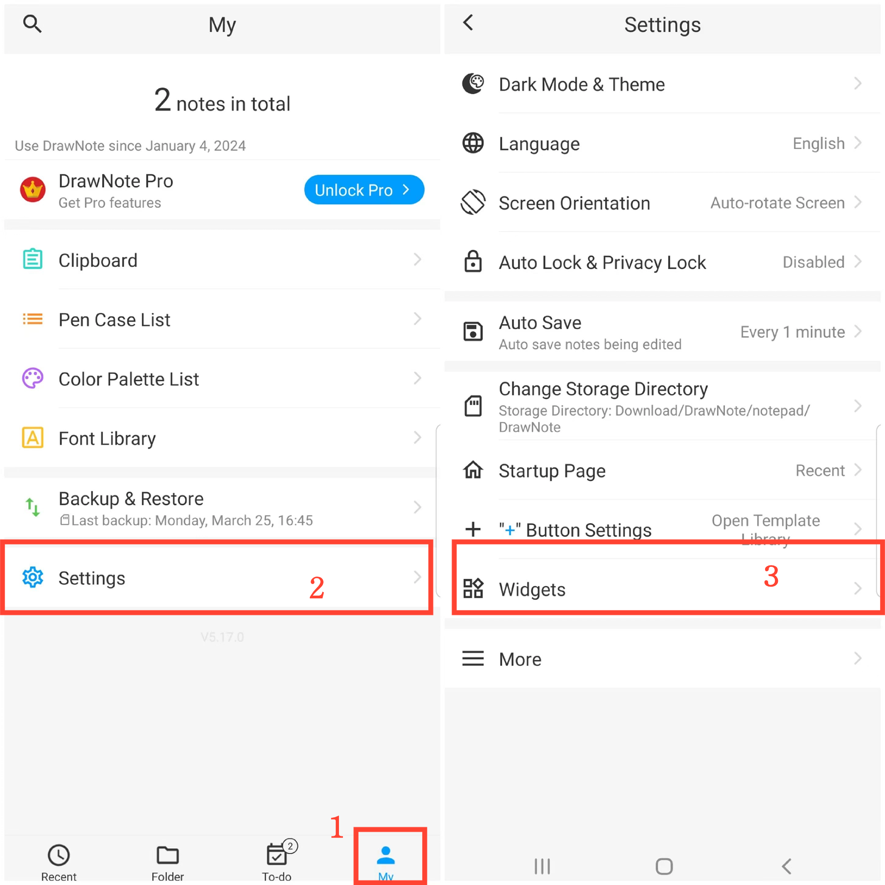

[User Manual](/dragonnest/drawnote/manual/en) > [More](/dragonnest/drawnote/manual/en/more) >

Desktop-Widget hinzufügen
---
Durch Hinzufügen von Desktop-Widgets auf den Hauptbildschirm Ihres Geräts können Sie Notizbearbeitungsfunktionen einfach und schnell aufrufen, ohne die Anwendung öffnen zu müssen.
### Operationsschritte
1. Tippen Sie auf "lch" auf dem Hauptbildschirm.
2. Geben Sie "Einstellungen" ein.
3. Klicken Sie auf "Widgets" und wählen Sie den Typ des Widgets aus, das Sie hinzufügen möchten.

#### Hinweis
Sie können auch direkt auf dem Startbildschirm Ihres Geräts auf die Widget-Einstellungen zugreifen, die Anwendung finden und dann das Desktop-Widget hinzufügen.