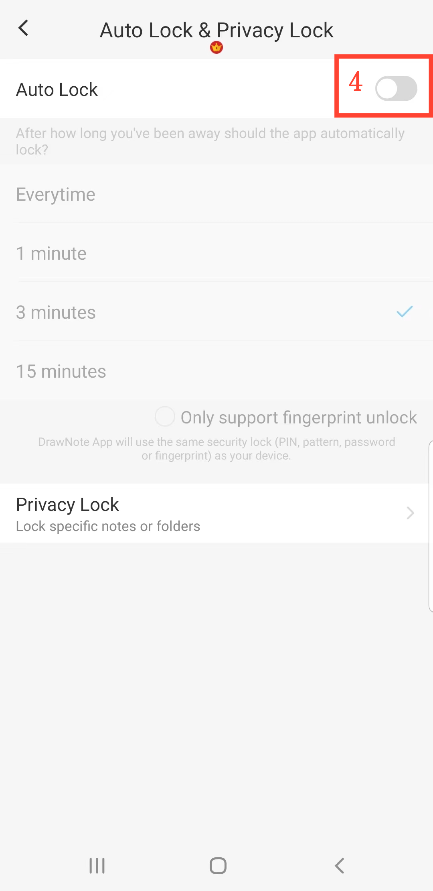

[Benutzerhandbuch](/dragonnest/drawnote/manual/de) > [Mehr](/dragonnest/drawnote/manual/de/more) >

Automatische Sperre
---
Automatische Sperre bezieht sich darauf, dass die Anwendung automatisch gesperrt wird, nachdem eine bestimmte Zeit lang keine Aktivität stattgefunden hat. Dies dient der Verbesserung der Privatsphäre und der Datensicherheit, um unbefugten Zugriff zu verhindern.

#### Schritte

1. Tippen Sie auf "lch" auf der Hauptseite.

2. Gehen Sie zu den Einstellungen.

3. Klicken Sie auf "Automatische Sperre & Datenschutzsperre".

4. Aktivieren Sie den Schalter für "Automatische Sperre" und wählen Sie die Zeit für die automatische Sperre aus.

