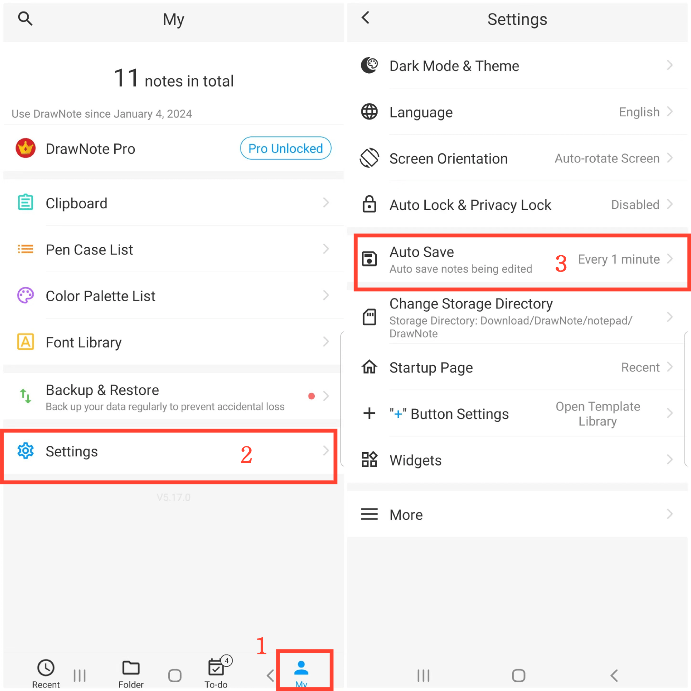
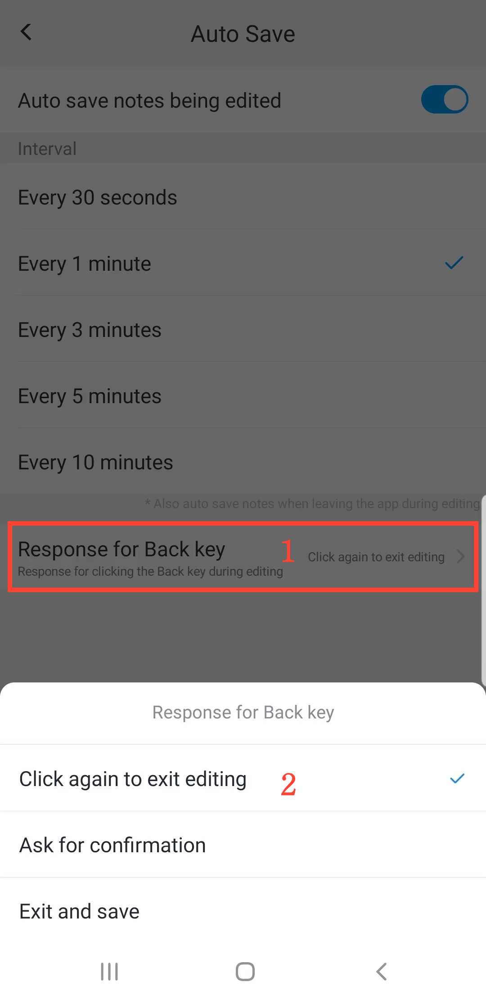

[User Manual](/dragonnest/drawnote/manual/en) > [More](/dragonnest/drawnote/manual/en/more) >

Automatisch speichern
---
Automatisch speichern verhindert versehentlichen Datenverlust.

#### Schritte

1. Tippen Sie auf "lch" auf der Hauptseite.

2. Gehen Sie zu den Einstellungen.

3. Klicken Sie auf die Schaltfläche "Automatisch speichern".

4. Aktivieren Sie den Schalter und wählen Sie die Automatisches Speichern von bearbeiteten Notizen aus.

#### Hinweis
- Anpassbare Reaktion auf das Klicken der Zurück-Taste während der Bearbeitung. Reaktionsmethoden umfassen: Erneut klicken, um die Bearbeitung zu beenden, Nach Bestätigung fragen, Bearbeitung beenden und speichern.

  