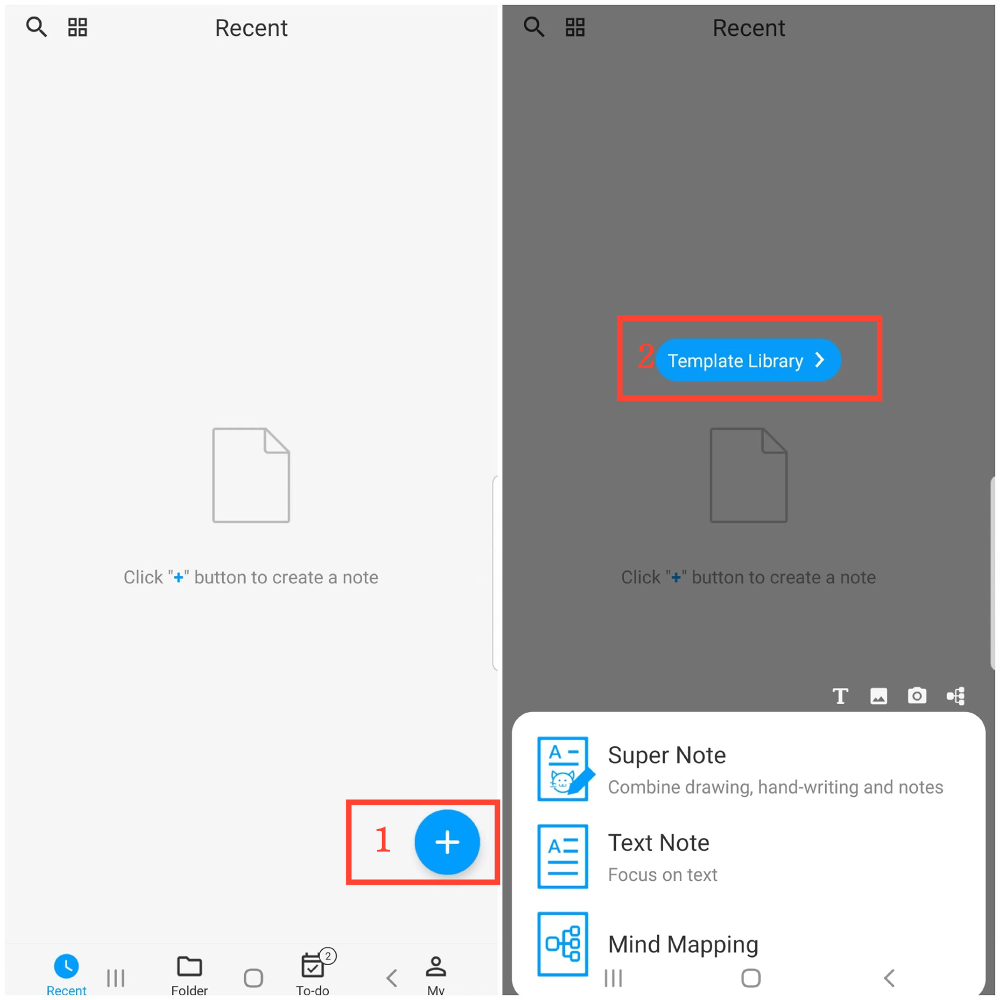
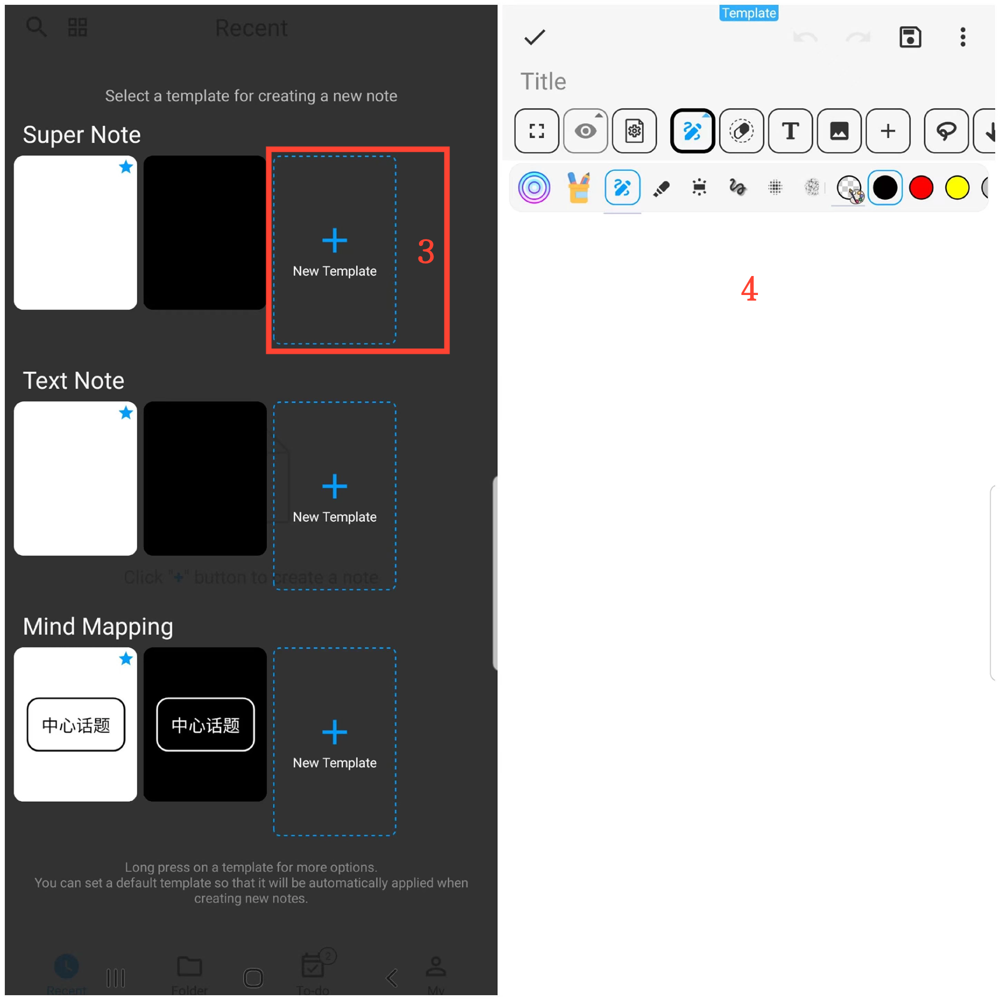
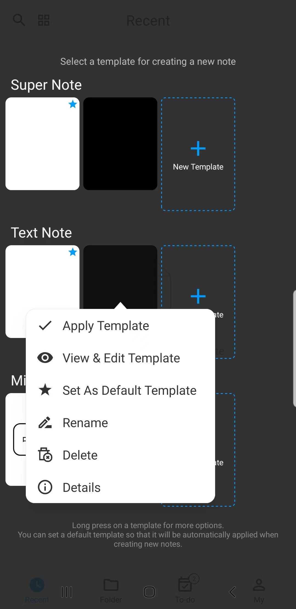

[User Manual](/dragonnest/drawnote/manual/de) > [More](/dragonnest/drawnote/manual/de/more) >

Vorlagen erstellen
---
Durch das Erstellen von Vorlagen können Sie automatisch die Konfiguration der Vorlage anwenden, wenn Sie eine neue Notiz erstellen, wie z.B. Hintergrundfarbe, Schriftgröße, Schriftfarbe und andere gängige Einstellungen.

### Schritte
1. Tippen Sie auf dem Startbildschirm der App auf das "+"-Symbol in der unteren rechten Ecke.
2. Tippen Sie auf "Vorlagensammlung".
3. Wählen Sie nach dem gewünschten Notiztyp "Neue Vorlage" aus.
4. Geben Sie die Vorlagenbearbeitungsseite ein, um Konfigurationen einzurichten, einschließlich Hintergrundfarbe, Schriftgröße, Schriftfarbe usw., und speichern Sie, wenn Sie fertig sind.

#### Hinweis
Halten Sie die Vorlagenbibliothek gedrückt, um auf weitere Optionen zuzugreifen, wie z.B. Vorlage anzeigen und bearbeiten, Als Standardvorlage festlegen, usw.
