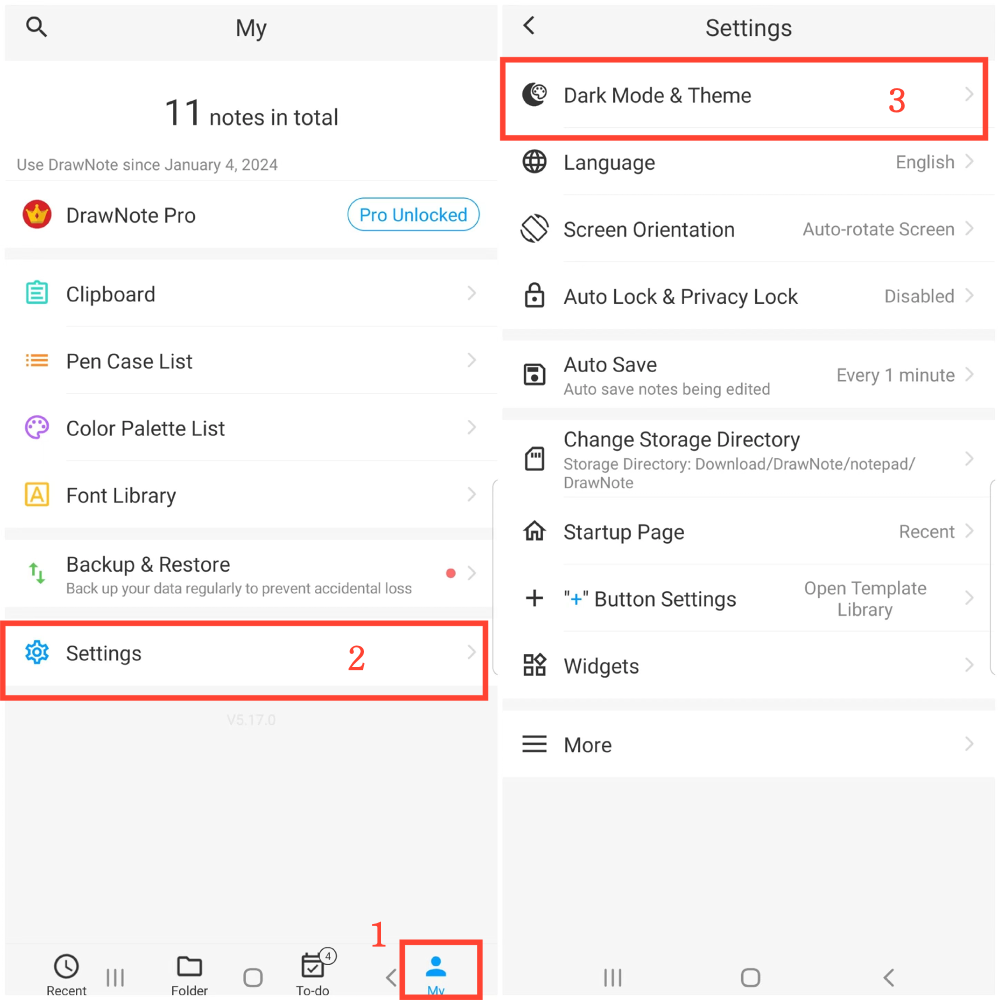

[User Manual](/dragonnest/drawnote/manual/en) > [More](/dragonnest/drawnote/manual/en/more) >

Dark Mode und Themenwechsel
---
Der Dunkelmodus bietet ein angenehmeres Leseerlebnis, hilft, die Augenbelastung zu reduzieren und die visuelle Gesundheit zu schützen. Diese Funktion ermöglicht es Ihnen, einfach in einen komfortableren Dunkelmodus zu wechseln und je nach persönlicher Vorliebe Themenfarben auszuwählen.

### Schritte
1. Tippen Sie auf "Mein" auf dem Hauptbildschirm.
2. Gehen Sie zu den Einstellungen.
3. Klicken Sie auf "Dunkelmodus & Thema".
4. Hier können Sie in den Dunkelmodus wechseln und verschiedene Themenfarben auswählen, um die Benutzeroberfläche nach Ihren Wünschen anzupassen.

