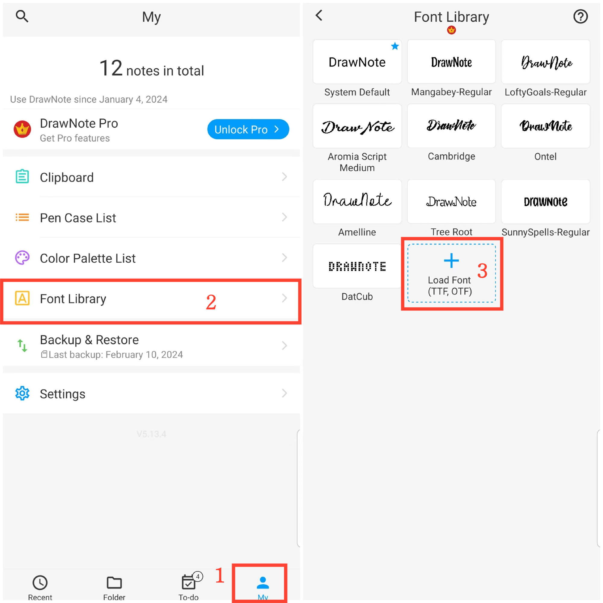

[User Manual](/dragonnest/drawnote/manual/en) > [More](/dragonnest/drawnote/manual/en/more) >

Schriftartenbibliothek
---
Die Schriftbibliothek kann Ihre häufig verwendeten Schriftarten speichern. Sie ermöglicht es Ihnen, den geeigneten Schriftstil frei in Textnotizen oder Textfeldern zu wählen.
#### Schritte
1. Tippen Sie auf "lch" auf der Hauptseite.

2. Greifen Sie auf die Schriftbibliothek zu.

3. Klicken Sie auf "Schrift laden" und wählen Sie eine Schriftdatei zum Importieren aus.

#### Hinweis
Sie können die gewünschten Schriftarten von dieser Website herunterladen: https://www.fontspace.com/commercial-fonts