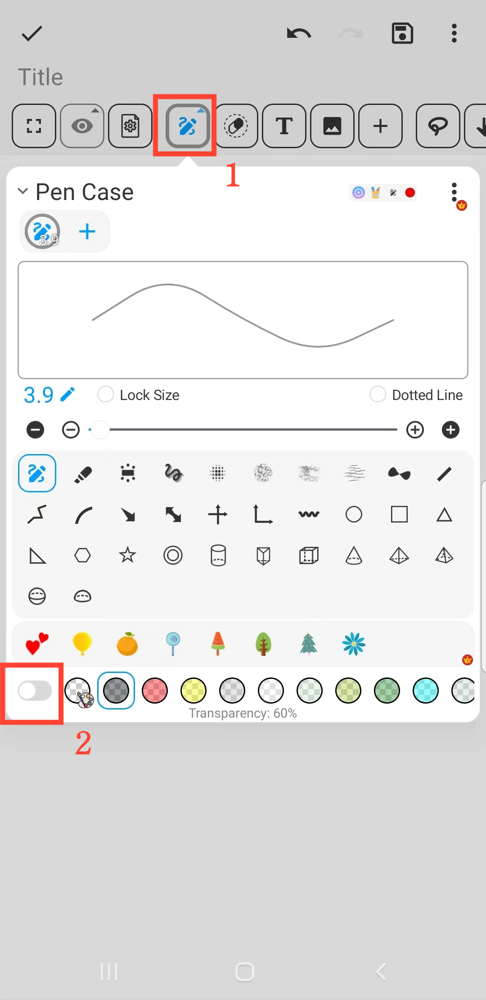

[User Manual](/dragonnest/drawnote/manual/en) > [More](/dragonnest/drawnote/manual/en/more) >

Highlighter Effect
---
Der Textmarker-Effekt kann Ihnen helfen, wichtige Informationen hervorzuheben.

#### Schritte
1. Auf der Super-Notizen-Seite klicken Sie auf die Schaltfläche "Stifthalter".

2. In dem Popup-Menü klicken Sie auf die untere Schaltfläche, um die Pinsel-Farbsättigung zu ändern und den Textmarker-Effekt zu erzielen.

