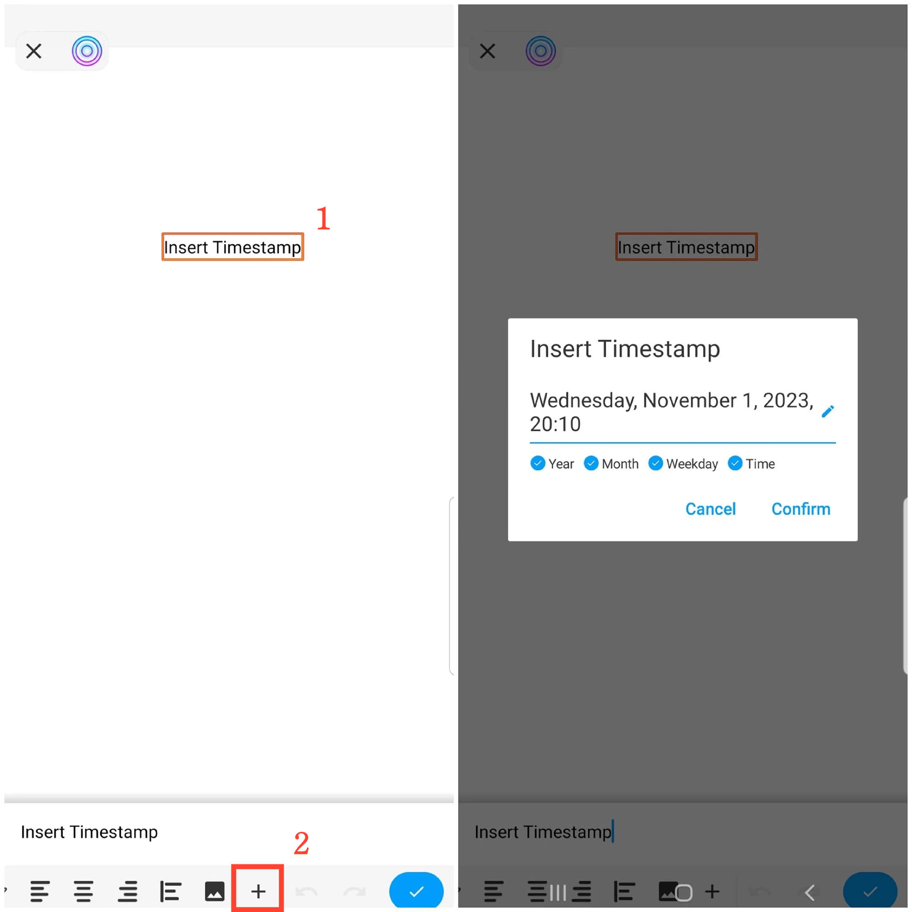

[User Manual](/dragonnest/drawnote/manual/en) > [More](/dragonnest/drawnote/manual/en/more) >

Zeitstempel einfügen
---
Das Einfügen eines Zeitstempels erleichtert es Ihnen, die Zeit Ihrer Notizen zu protokollieren.

#### Schritte
In Textnotizen wischen Sie nach links und tippen Sie auf das "+"-Symbol, wählen Sie dann "Zeitstempel einfügen" und bestätigen Sie.

In Super-Notizen und Mind Mapping wählen Sie ein Textfeld, öffnen Sie das Textmenü, wischen Sie nach links und tippen Sie auf das "+"-Symbol, wählen Sie dann "Zeitstempel einfügen" und bestätigen Sie.

