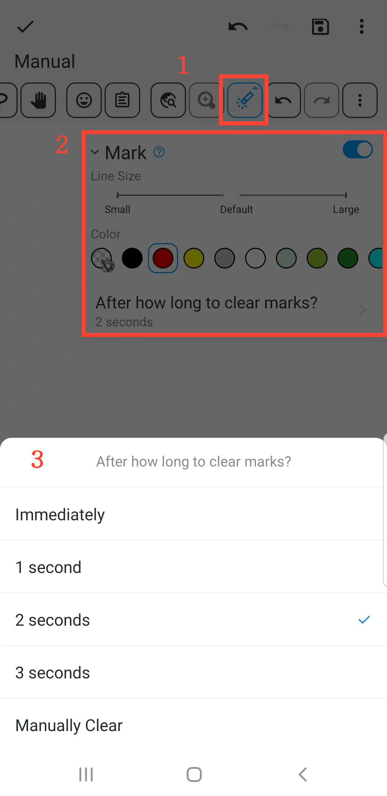

[User Manual](/dragonnest/drawnote/manual/de) > [More](/dragonnest/drawnote/manual/de/more) >

Markierungsfunktion
---
Die Markierungsfunktion hilft Ihnen, Schlüsselpunkte hervorzuheben und Aufmerksamkeit zu erregen, geeignet für Unterricht und Präsentationen.

#### Schritte

1. Klicken Sie auf die "Markieren"-Schaltfläche in der Symbolleiste, um Markierungs-Demonstrationen auf der Leinwand durchzuführen.

2. Sie können die Linienstärke und Farben anpassen.

3. Darüber hinaus können Sie eine automatische Löschzeit für die Markierungen einstellen oder sie manuell löschen.

#### Hinweis
Die Markierungsfunktion ist für Demonstrationen gedacht, und Markierungen werden beim Verlassen der Leinwand gelöscht. Wenn Sie Inhalte hervorheben und dauerhaft speichern müssen, können Sie in den Bearbeitungsmodus wechseln und das Stiftwerkzeug zum Markieren verwenden.