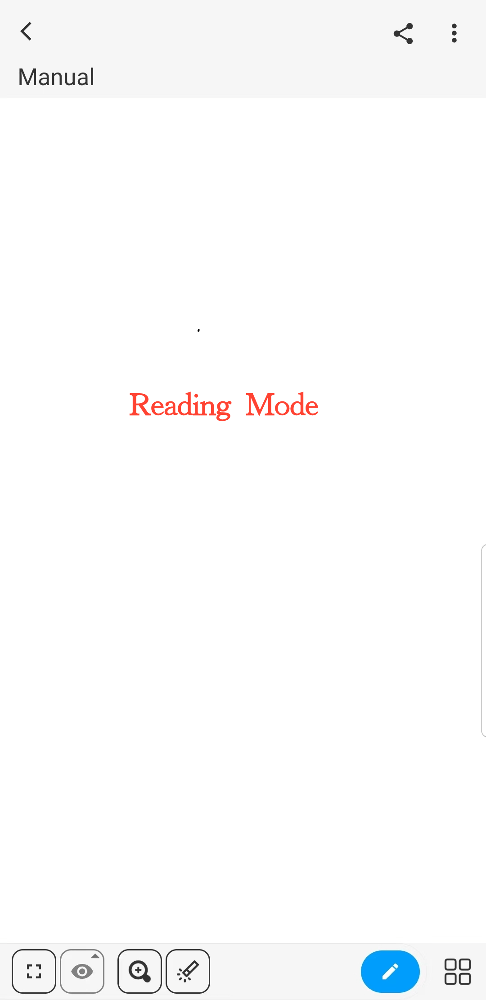

[Benutzerhandbuch](/dragonnest/drawnote/manual/en) > [Mehr](/dragonnest/drawnote/manual/en/more) >

Lesemodus und Bearbeitungsmodus
---
Lesemodus und Bearbeitungsmodus sind zwei Zustände von Notizen, die verwendet werden, um Noteninhalt anzuzeigen und zu bearbeiten.

#### Lesemodus
- Wählen Sie die Notiz aus, die Sie anzeigen möchten, und klicken Sie, um in den Lesemodus zu gelangen.

- Wenn Sie derzeit eine Notiz bearbeiten, klicken Sie auf das Symbol "√" in der oberen linken Ecke, um in den Lesemodus zu wechseln.

#### Bearbeitungsmodus
- Wenn Sie derzeit eine Notiz lesen, klicken Sie auf das Symbol "Stift" in der unteren rechten Ecke, um in den Bearbeitungsmodus für die Notizbearbeitung zu wechseln.

Im Lesemodus können Sie:

- Noteninhalt anzeigen und für Informationen vergrößern oder verkleinern.

- Zu verwandten Notizen springen, um weitere Informationen zu erhalten.

- Auf das Webseitenlink-Symbol klicken, um zur entsprechenden Webseite zu navigieren.

- Bilder innerhalb der Notiz anzeigen, speichern oder teilen.

- Auf das Symbol "⋮" in der oberen rechten Ecke klicken, um Optionen wie Umbenennen, Verschieben, Löschen, Exportieren und mehr zu erhalten.

- Klicken Sie auf die Symbolleiste unten für Standardansichtsumschaltung, Markierung, Zoomen, Notizumschaltung, Ordnererstellung und andere Operationen.