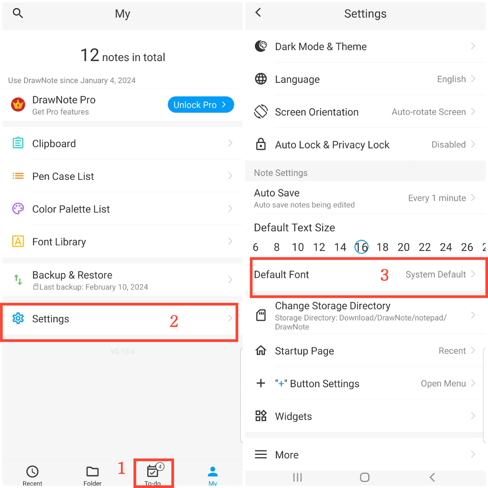

[User Manual](/dragonnest/drawnote/manual/en) > [More](/dragonnest/drawnote/manual/en/more) >

Standard-Schriftart einstellen
---
Die Schriftartenbibliothek ermöglicht es Ihnen, häufig verwendete Schriftarten zu speichern, die Sie dann für Texte in Textnotizen oder Textfeldern auswählen können.

#### Hinzufügen von Schriftarten
1. Tippen Sie auf "lche" auf der Hauptseite.

2. Greifen Sie auf die Einstellungen zu.

3. Klicken Sie auf "Standard-Schriftart".

4. Wählen Sie die benötigte Schriftart aus.

#### Hinweis
Neben dem Festlegen der Standard-Schriftart können Sie auch die Farbpalette, die Farbposition und die Standardtextgröße auf der Einstellungsseite festlegen.