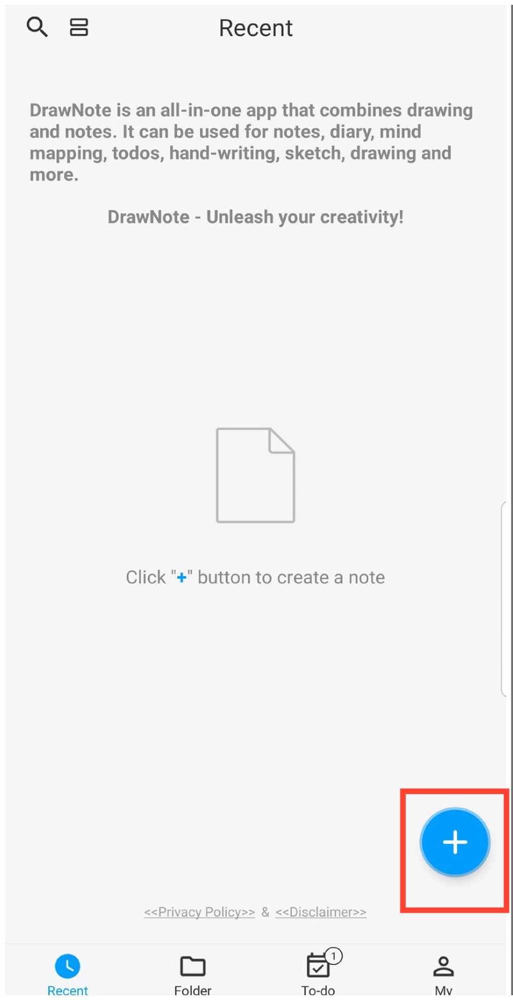
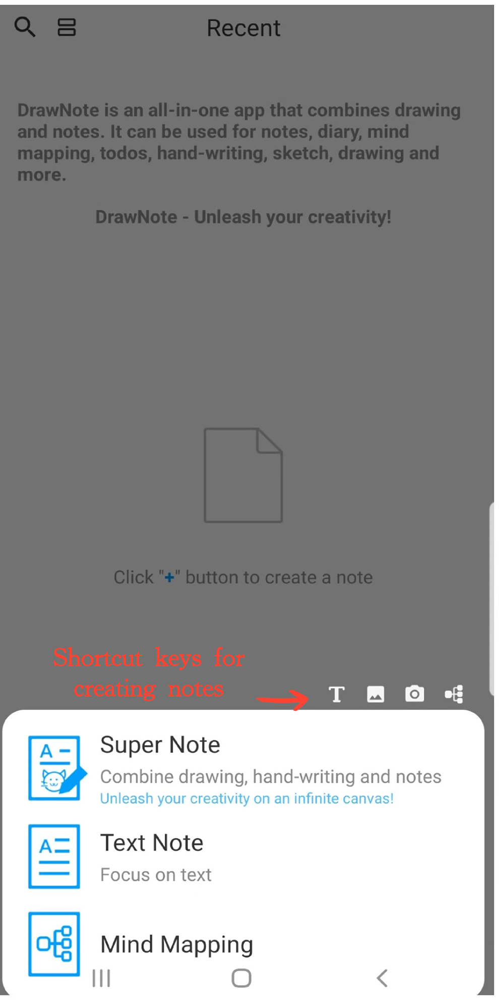

[User Manual](/dragonnest/drawnote/manual/en) >

Create a New Note
---
DrawNote offers a variety of flexible note types to meet different user scenarios, including Super Note, Text Note, and Mind Mapping.

- Super Note- A comprehensive note that combines handwriting, drawing, text, images, audio recordings, tables, and mind maps. It allows you to fully express your creativity and artistic talent on a flexible canvas.

- Text Note - Focused on text recording and supports rich text settings as well as image insertions, making your notes more diverse and visual.

- Mind Mapping - Helps you quickly capture ideas and organize knowledge, presenting complex concepts in a clear graphical structure.

#### Steps

On the app's homepage, tap the "+" icon in the bottom right corner. Then, select the type of note you want to create to start your note.

#### Tips

- When you tap the "+" button in the 'Folder' section to create a new note, the note will automatically be categorized under the current folder.

- You can also utilize the shortcuts at the top of the menu to quickly access various creation interfaces within Super Note.

