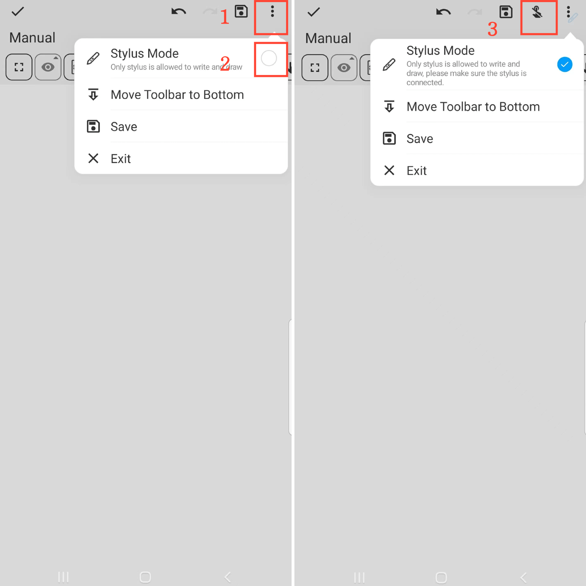

[Benutzerhandbuch](/dragonnest/drawnote/manual/en) > [FAQ](/dragonnest/drawnote/manual/en/q_a) >

Wie kann ich versehentliche Berührungen mit lchen Fingern verhindern?
---
Auf der Super Note-Seite klicken Sie auf die "⋮" Mehr-Schaltfläche in der oberen rechten Ecke des Bildschirms und aktivieren Sie den Stylus-Modus.

Sobald sich im Stylus-Modus befinden, erscheint oben auf der Seite eine Schaltfläche "Fingerberührung deaktivieren". Sie können diese Schaltfläche anklicken, um versehentliche Berührungen mit den Fingern zu verhindern.

