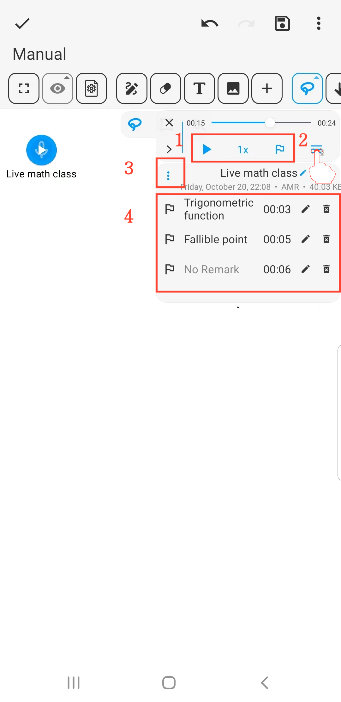

[User Manual](/dragonnest/drawnote/manual/de) > [Super Note](/dragonnest/drawnote/manual/de/super_note) >

Audio-Marker
---
Der Audio-Marker ähnelt einem Lesezeichen und hilft Ihnen dabei, wichtige Abschnitte während der Audioaufnahme oder -wiedergabe schnell zu finden und wiederzugeben.

#### Schritte

Während der Aufnahme oder Wiedergabe klicken Sie auf die "Marker"-Schaltfläche, um einen Marker zur aktuellen Zeit einzufügen.

#### Hinweis

1. **Audio-Geschwindigkeit anpassen und Marker hinzufügen** - Einfach in der Symbolleiste durchführbar.

2. **Aufnahme und Marker-Namen bearbeiten** - Klicken Sie auf die "≡"-Schaltfläche rechts und dann auf die "Stift"-Schaltfläche.

3. **Audio herunterladen** - Klicken Sie auf die "⋮"-Schaltfläche links, um herunterzuladen.

4. **Audio-Marker-Verlauf anzeigen** - Marker im erweiterten Menü anzeigen; Klicken Sie auf einen Marker, um schnell zum Audio zu springen und es abzuspielen.

