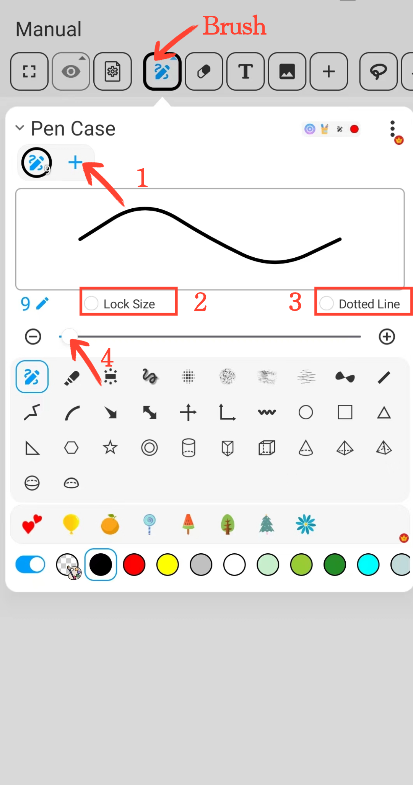
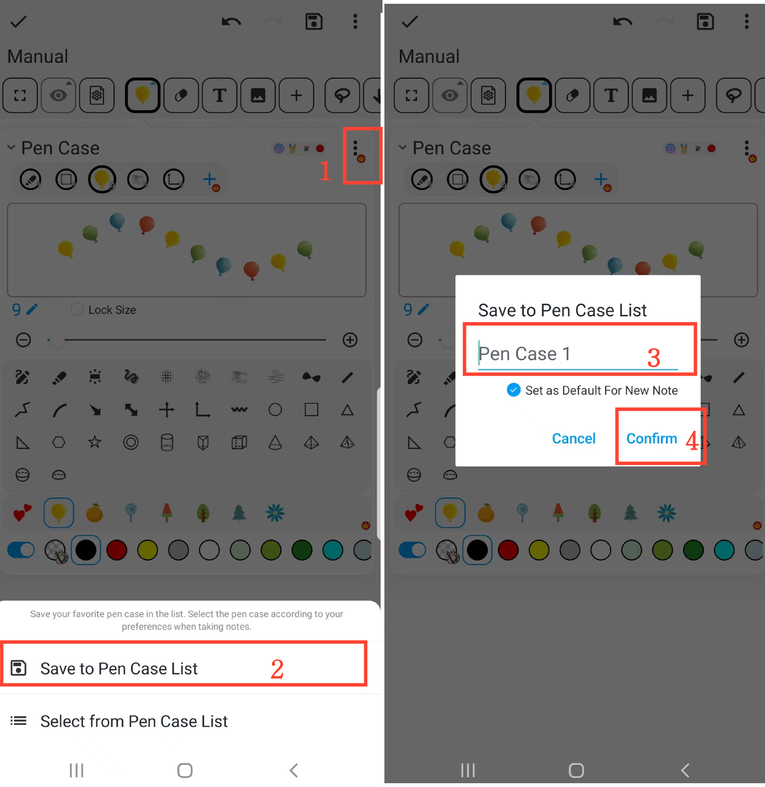

[Benutzerhandbuch](/dragonnest/drawnote/manual/de) > [Super-Notiz](/dragonnest/drawnote/manual/de/super_note) >

Stifthalter-Funktion
---

#### Schritte

Klicken Sie auf die "Stifthalter"-Schaltfläche in der Symbolleiste, um die folgenden Aktionen auszuführen.

#### 1. Stifte sammeln

Klicken Sie auf die "+"-Schaltfläche in der Stifte-Sammlungsleiste, um verschiedene Arten von Stiften hinzuzufügen.

#### 2. Stiftgröße sperren

Aktivieren Sie die "Größe sperren"-Schaltfläche, um die Stiftgröße festzulegen. Auch wenn Sie auf der Leinwand oder Seite herein- oder herauszoomen, bleibt die Stiftgröße unverändert.

#### 3. Gestrichelter Linien-Effekt

Aktivieren Sie die "Gestrichelte Linie"-Schaltfläche, um den gestrichelten Linien-Stift-Effekt anzuwenden.

#### 4. Stiftgröße anpassen

Verwenden Sie den mittleren Schieberegler oder die "+" und "-" Schaltflächen auf beiden Seiten, um die Stiftstrichgröße anzupassen.

#### 5. Stiftposition anpassen

Drücken und halten Sie in der Stiftleiste den Stift, den Sie anpassen möchten, und ziehen Sie ihn dann nach links oder rechts an die gewünschte Position und lassen Sie ihn los.

#### 6. Stifte sammeln löschen

Drücken und halten Sie in der Stiftleiste den Stift, den Sie löschen möchten, und ziehen Sie ihn dann zum "Papierkorb"-Symbol und lassen Sie ihn los, um diesen Stift zu entfernen.

#### Häufig verwendeten Stifthalter speichern

Auf der Stifthalter-Seite klicken Sie auf die "⋮"-Schaltfläche in der oberen rechten Ecke und wählen Sie "Ln Stifthalterliste speichern". Geben Sie dann Ihren Stifthalter einen Namen und bestätigen Sie, um Ihren häufig verwendeten Stifthalter zu speichern.

#### Häufig verwendeten Stifthalter auswählen

Auf der Stifthalter-Seite klicken Sie auf die "⋮"-Schaltfläche in der oberen rechten Ecke und wählen Sie dann den benötigten Stifthalter aus der Stifthalterliste aus.

