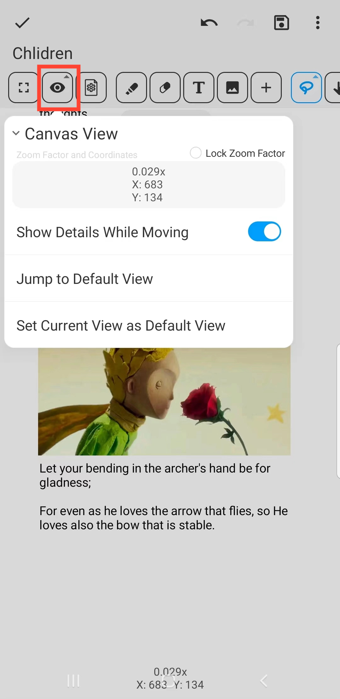

[Benutzerhandbuch](/dragonnest/drawnote/manual/de) > [Super-Notiz](/dragonnest/drawnote/manual/de/super_note) >

Canvas Ansicht
---
Die Canvas Ansicht ist die Benutzeroberfläche zum Anzeigen und Bearbeiten von Notizen und enthält Koordinaten- und Zoominformationen.

- Um das Durchsuchen großer oder inhaltsreicher Seiten zu erleichtern, können Sie eine Standardansicht festlegen.

- Klicken Sie auf die Schaltfläche "Zur Standardansicht springen", um schnell zu Ihrer festgelegten Standardansichtsposition zurückzukehren.

#### Zoom-Faktor sperren
Nach dem Aktivieren von "Zoom-Faktor sperren" behält die Leinwand ihre aktuelle Zoomstufe bei und verhindert zoomen durch Gesten.