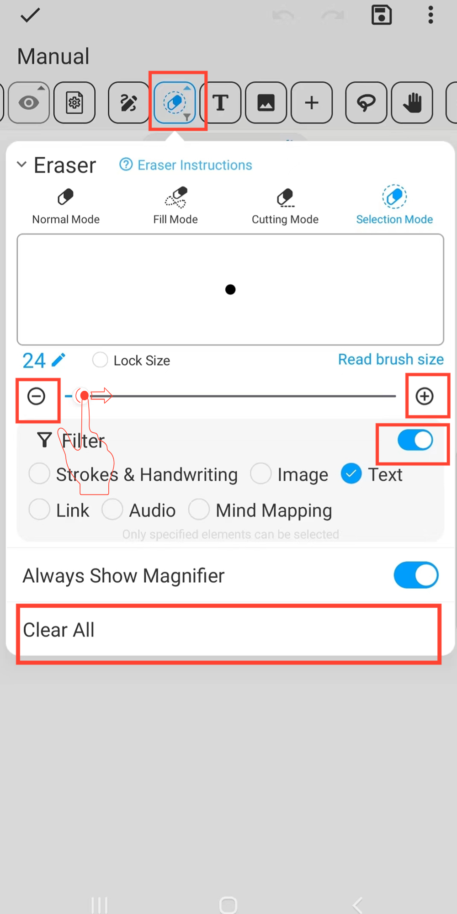

[Benutzerhandbuch](/dragonnest/drawnote/manual/de) > [Super-Notiz](/dragonnest/drawnote/manual/de/super_note) >

Radiergummi
---
Die Radiergummi-Funktion bietet mehrere Modi für verschiedene Anwendungsfälle.
#### Schritte

Klicken Sie auf die Schaltfläche "Radiergummi" in der Symbolleiste.

- Normaler Modus - Verwendet Maskentechnologie, um den Radiergummi-Effekt realistisch zu simulieren. Kann verschiedene Elemente wie Linien, Text und Bilder löschen. In diesem Modus werden Radierungszeichen erstellt, die es Benutzern ermöglichen, gelöschte Elemente auszuwählen.

- Füllmodus - Ähnlich wie der Normalmodus, kann jedoch schnell einen fächerförmigen Bereich löschen.

- Schneidmodus - Teilt Elemente in mehrere unabhängige Teile auf, nur anwendbar auf Linien und einige geometrische Formen. Dieser Modus hinterlässt nach dem Löschen keine Spuren.

- Auswahlmodus - Löscht das ausgewählte gesamte Element direkt und unterstützt das Festlegen von Filterkriterien. Dieser Modus hinterlässt nach dem Löschen keine Spuren.

#### Hinweis
- Klicken Sie auf "Alle löschen", um die gesamte Leinwand zu leeren.