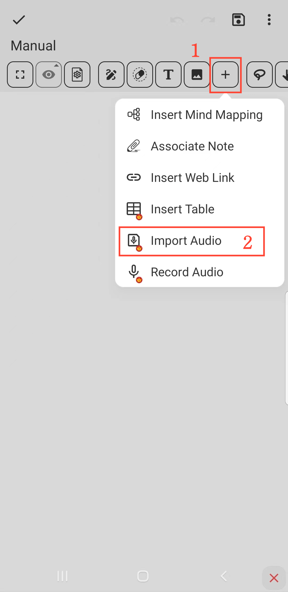

[Benutzerhandbuch](/dragonnest/drawnote/manual/de) > [Super-Notiz](/dragonnest/drawnote/manual/de/super_note) >

Audio importieren
---
#### Schritte

1. Klicken Sie auf die Schaltfläche "+" in der Symbolleiste.

2. Wählen Sie die Option "Audio importieren". Wählen Sie die Audiodatei aus, die Sie importieren möchten, und fertig.

