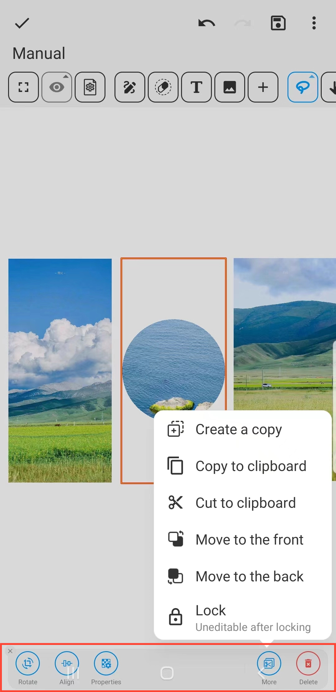

[Benutzerhandbuch](/dragonnest/drawnote/manual/de) > [Super-Notiz](/dragonnest/drawnote/manual/de/super_note) >

Bilder einfügen
---
#### Schritte

1. Klicken Sie auf die Schaltfläche "Bild" in der Symbolleiste.

2. Tippen Sie auf einen Bereich des Bildschirms, um Bilder einzufügen.

#### Hinweis
- Nach Auswahl eines Bildes bietet die untere Symbolleiste Bearbeitungsoptionen wie Drehung, Form und Transparenz.

- Sie können die Textfunktion verwenden, um den Inhalt des Bildes für einen detaillierteren und genaueren Ausdruck zu annotieren.

- Klicken Sie auf das Bild, um es zu verkleinern.

