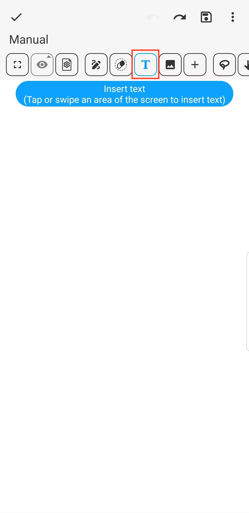
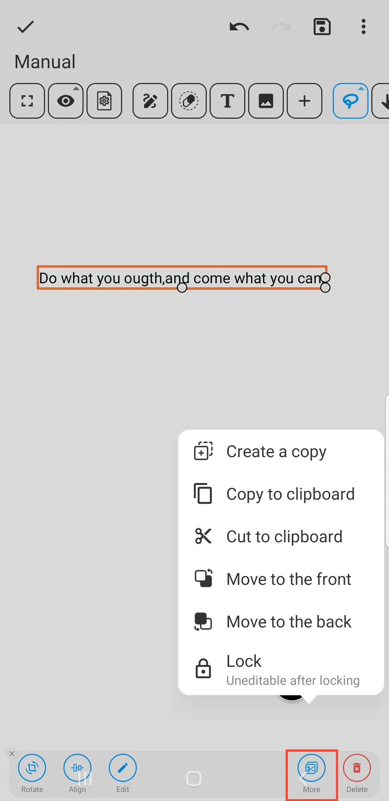
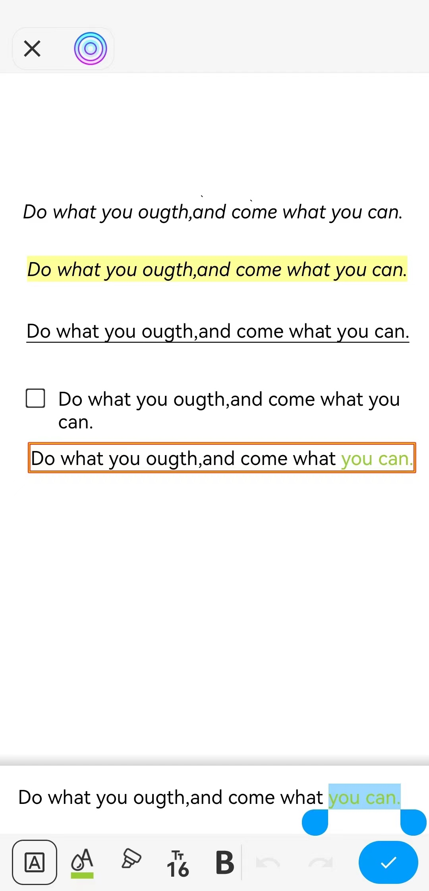

[Benutzerhandbuch](/dragonnest/drawnote/manual/de) > [Super-Notiz](/dragonnest/drawnote/manual/de/super_note) >

Text einfügen
---
#### Schritte

1. Klicken Sie auf die Schaltfläche "T" in der Symbolleiste.

2. Tippen Sie auf einen Bereich des Bildschirms, um Text einzufügen.

#### Hinweis
- Sobald das Textfeld ausgewählt ist, können Sie es drehen, ausrichten, bearbeiten und mehr. Durch Klicken auf "Mehr" können Sie außerdem eine Kopie erstellen, ausschneiden, in die Zwischenablage kopieren und mehr.

  

- Im Textbearbeitungsfeld, sobald der Text ausgewählt ist, können Sie sein Format festlegen, einschließlich Farbe, Größe, Fettdruck, Unterstreichung und mehr.

