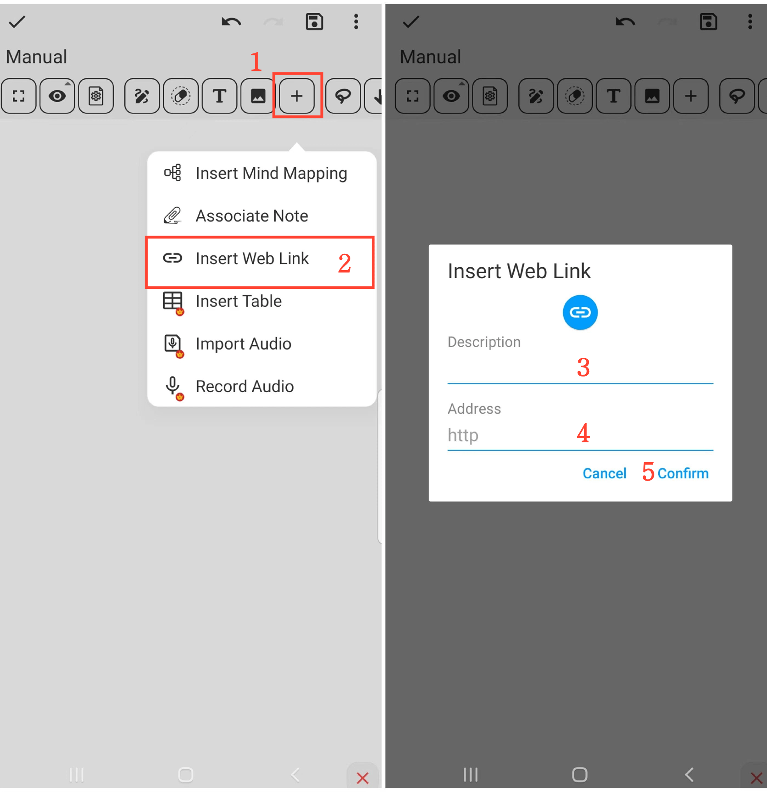

[Benutzerhandbuch](/dragonnest/drawnote/manual/de) > [Super-Notiz](/dragonnest/drawnote/manual/de/super_note) >

Web-Link einfügen
---
#### Schritte

1. Klicken Sie auf die Schaltfläche "+" in der Symbolleiste.

2. Wählen Sie die Option "Web-Link einfügen".

3. Füllen Sie den Linknamen aus (optional).

4. Geben Sie den Web-Link ein oder fügen Sie ihn ein.

5. Bestätigen Sie die Operation, um den Link einzufügen.

#### Hinweis
- Geben Sie dem Link einen beschreibenden Namen, um ihn später einfacher finden und lokalisieren zu können.

- Im Lese-Modus klicken Sie auf das Link-Symbol, um direkt auf die Webseite zuzugreifen.