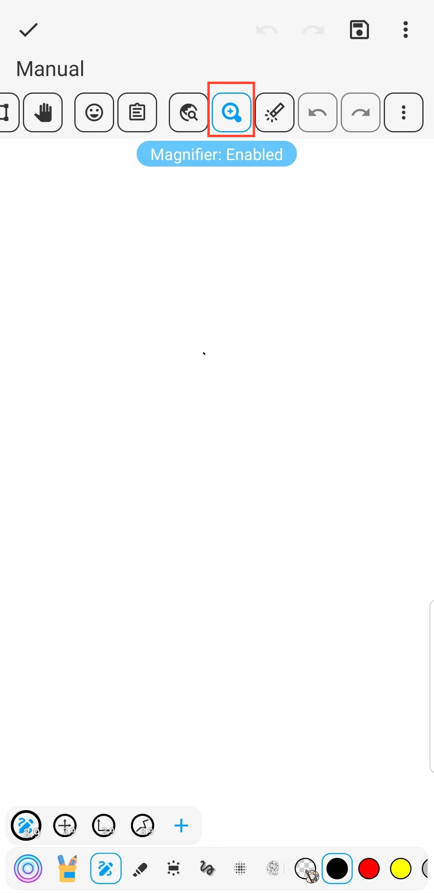

[Benutzerhandbuch](/dragonnest/drawnote/manual/en) > [Super-Notiz](/dragonnest/drawnote/manual/en/super_note) >

Lupe
---
Die Lupe-Funktion kann Ihnen helfen, Notizen bequemer anzuzeigen und zu bearbeiten. Besonders nützlich ist dies bei der Arbeit mit kleinen Schriftarten oder detaillierten Grafiken. Sie kann Text und Bilder vergrößern und eine präzise Positionierung sowie eine bequeme Bedienung ermöglichen.
#### Schritte

Auf der Seite "Super Notiz" klicken Sie auf die Lupen-Schaltfläche in der Symbolleiste.

