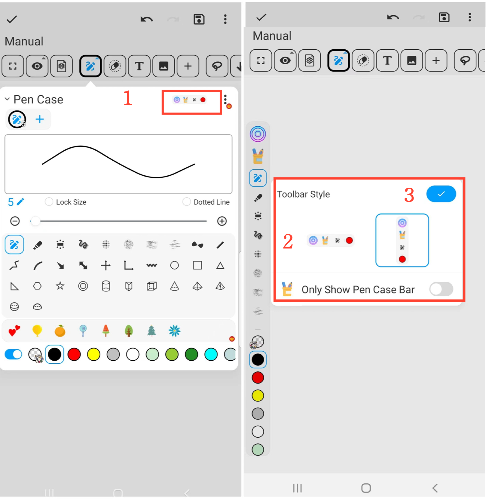
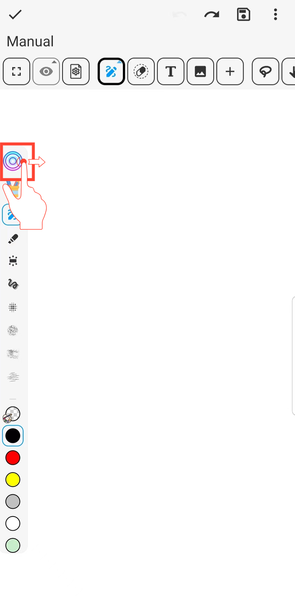

[Benutzerhandbuch](/dragonnest/drawnote/manual/en) > [Super-Notiz](/dragonnest/drawnote/manual/en/super_note) >

Verschieben der Stiftsymbolleiste
---

Sie können die horizontale oder vertikale Position der Stiftsymbolleiste auf der Leinwand anpassen, um einfache Auf- und Abbewegungen oder Links-Rechts-Bewegungen zu ermöglichen.

#### Schritte

1. Wählen Sie im Stiftetui "Symbolleistenstil" aus.

2. Wählen Sie die horizontale oder vertikale Ausrichtung.

3. Bestätigen Sie Ihre Auswahl.

#### Hinweis
- Halten Sie die kreisförmige Taste auf der Stiftsymbolleiste gedrückt, um ihre Position zu ziehen und anzupassen.

