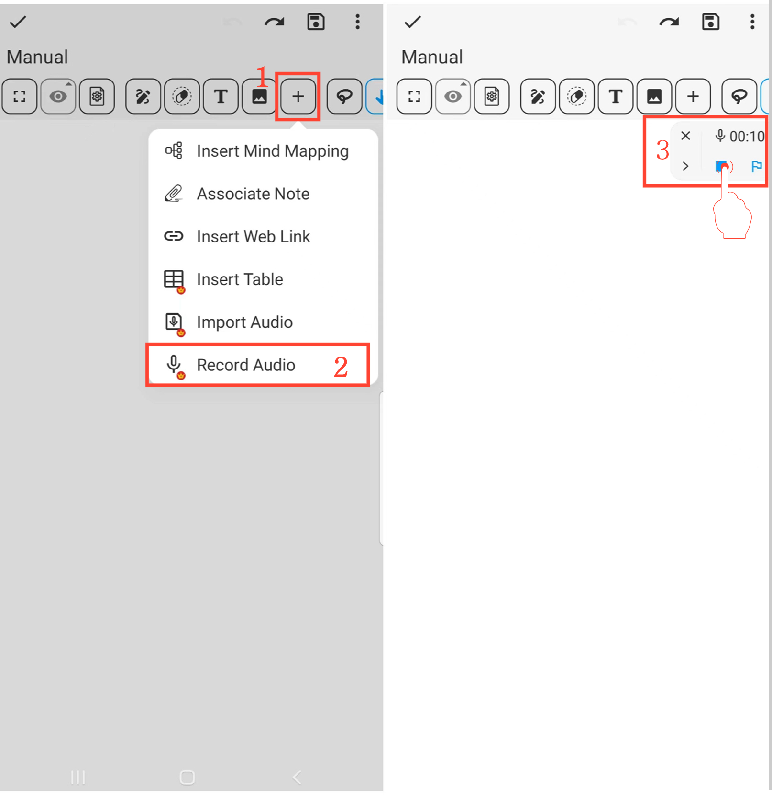

[Benutzerhandbuch](/dragonnest/drawnote/manual/de) > [Super-Notiz](/dragonnest/drawnote/manual/de/super_note) >

Audio aufnehmen
---
#### Schritte

1. Klicken Sie auf die Schaltfläche "+" in der Symbolleiste.

2. Wählen Sie die Option "Audio aufnehmen", um mit der Aufnahme von Audio zu beginnen.

3. Klicken Sie auf die Schaltfläche "Stop", um die Aufnahme zu beenden.

