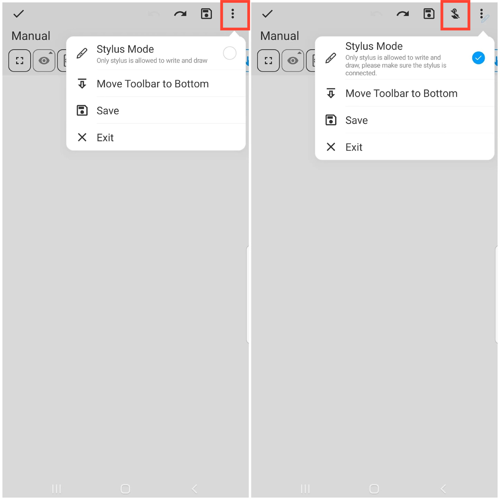

[Benutzerhandbuch](/dragonnest/drawnote/manual/de) > [Super-Notiz](/dragonnest/drawnote/manual/de/super_note) >

Stiftmodus
---

#### Schritte

1. Tippen Sie innerhalb der Super-Notizseite auf die Schaltfläche "⋮" Mehr, die sich oben rechts auf dem Bildschirm befindet.
2. Aktivieren Sie die Option Stiftmodus.
   

#### Tipp
- Stellen Sie vor dem Betreten des Stiftmodus sicher, dass der Stift erfolgreich verbunden ist.
- Nach Aktivierung des Stiftmodus wird oben auf der Seite ein Symbol mit der Aufschrift "Keine Fingerberührung" angezeigt. Sie können auf dieses Symbol tippen, um unbeabsichtigte Berührungen durch die Finger zu verhindern.