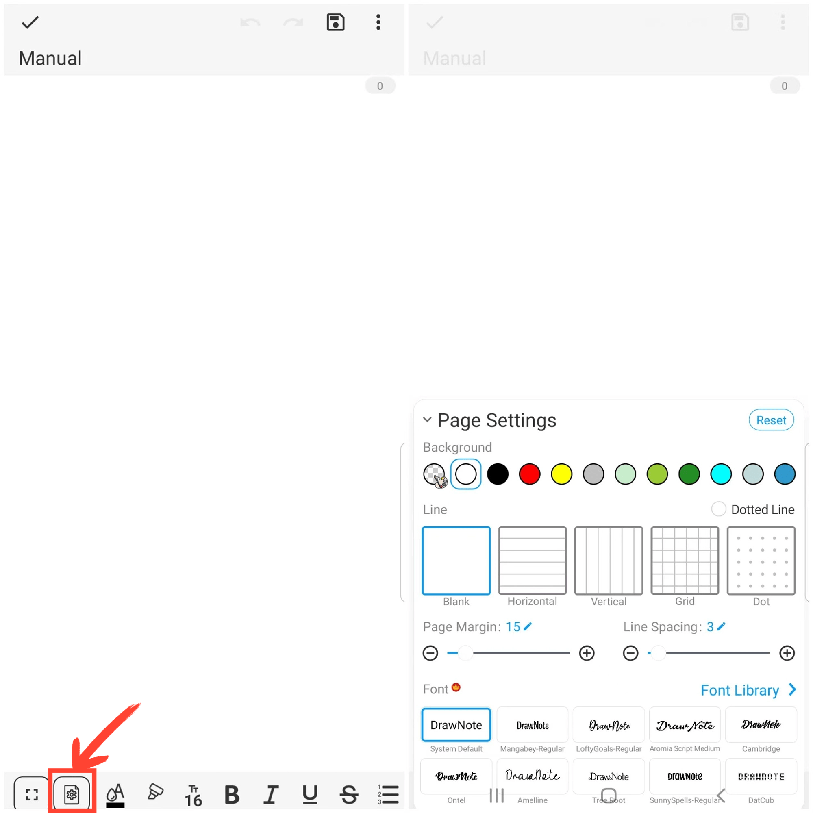

[User Manual](/dragonnest/drawnote/manual/de) > [Text Note](/dragonnest/drawnote/manual/de/text_note) >

Seiteneinstellungen
---
#### Bedienungsschritte

Klicken Sie auf das "Seiteneinstellungen"-Symbol in der Symbolleiste unten auf dem Bildschirm, um das Menü für die Seiteneinstellungen aufzurufen. Dort können Sie den Seitenhintergrund, den Linienstil, die Linienstärke, die Schriftmargen, den Zeilenabstand und den Schriftstil definieren, unter anderem.

