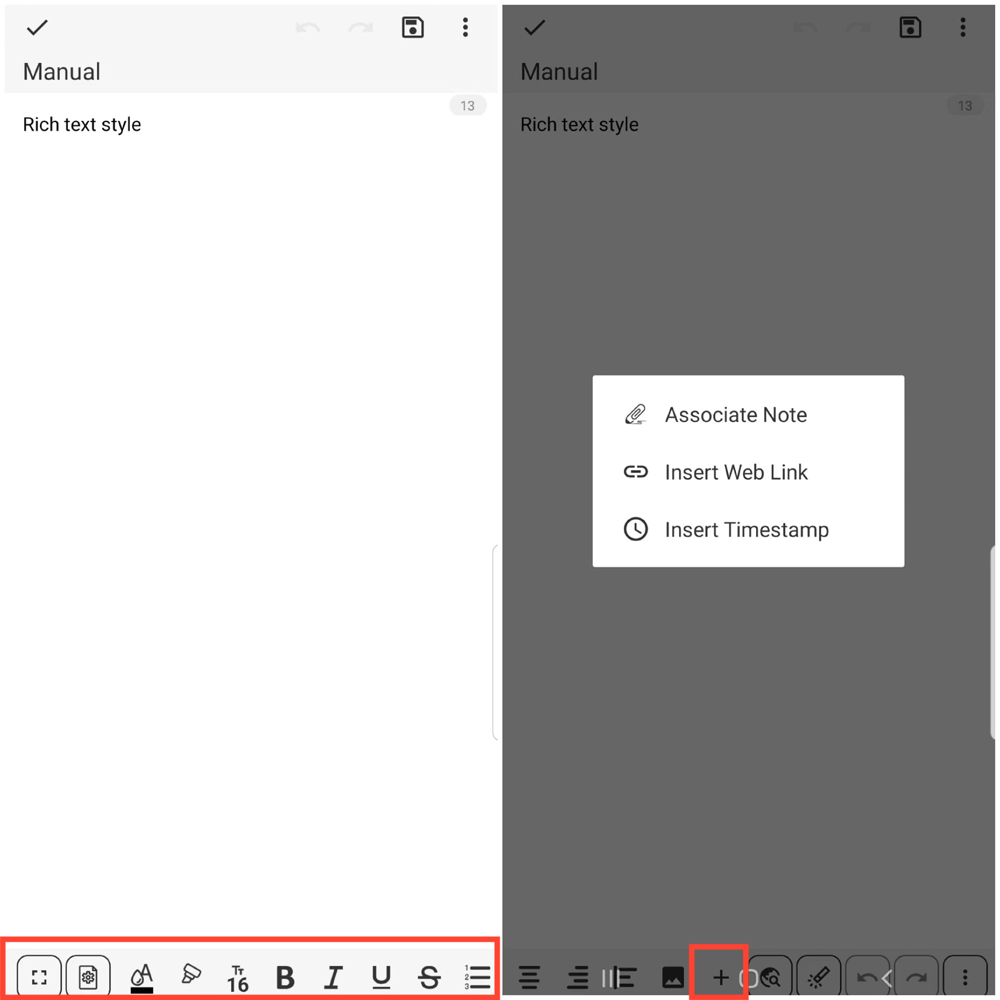

[Benutzerhandbuch](/dragonnest/drawnote/manual/de) > [Textnotiz](/dragonnest/drawnote/manual/de/text_note) >

Textformatierung
---
Das Textformatierungsfeature der Textnotiz bietet eine vielfältige Textbearbeitungserfahrung.

Neben der einfachen Textaufzeichnung können Sie auch die Schriftfarbe, -größe, -fett, -kursiv, -unterstrichen und andere Stile anpassen.

Darüber hinaus haben wir Schnelleingabefunktionen wie das Einfügen von Links, das Einfügen von Zeitstempeln und das Einfügen von Bildern eingeführt, um Ihre Bearbeitungseffizienz zu steigern.

