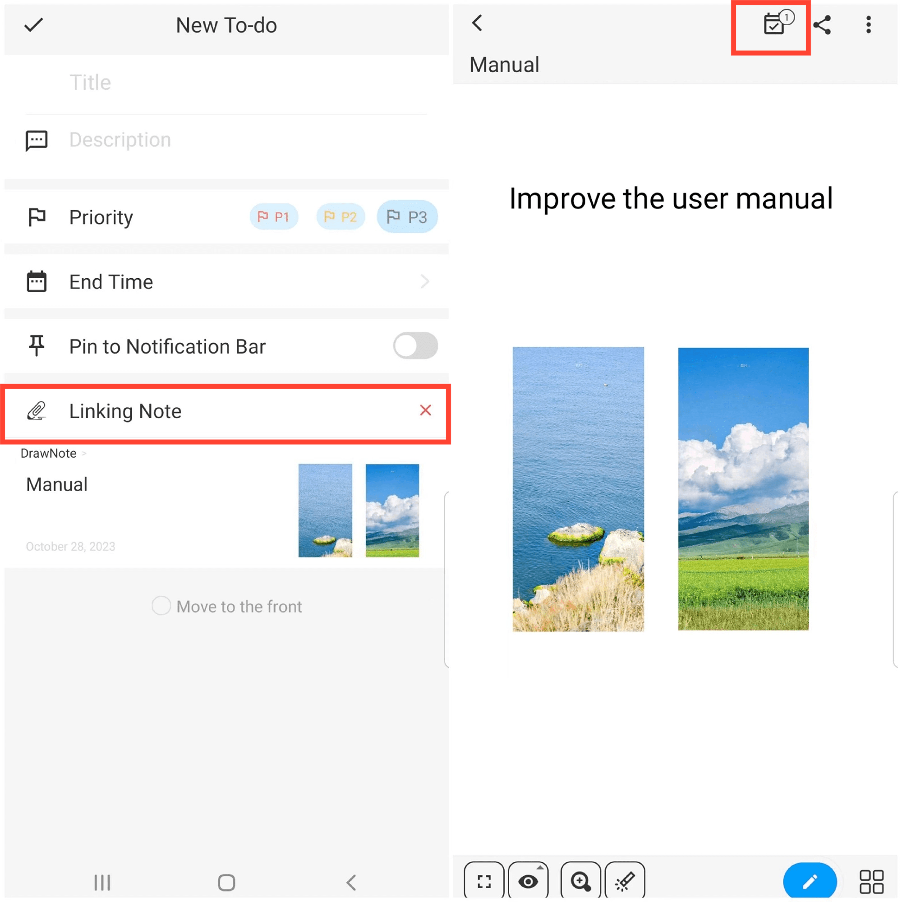

[Benutzerhandbuch](/dragonnest/drawnote/manual/de) > [Aufgabenliste](/dragonnest/drawnote/manual/de/to_do) >

Verknüpfte Notiz
---
Beim Erstellen eines Aufgaben-Elements können Sie wählen, "Verknüpfte Notiz".

Auf diese Weise können Sie einfach zu den verknüpften Notizen navigieren, indem Sie einfach auf das Aufgaben-Element klicken.

Zusätzlich können Sie beim Anzeigen einer Notiz Markierungen sehen, die sich auf das Aufgaben-Element beziehen, und diese dienen als Erinnerungen, um die zugehörigen Aufgaben zu erledigen.

