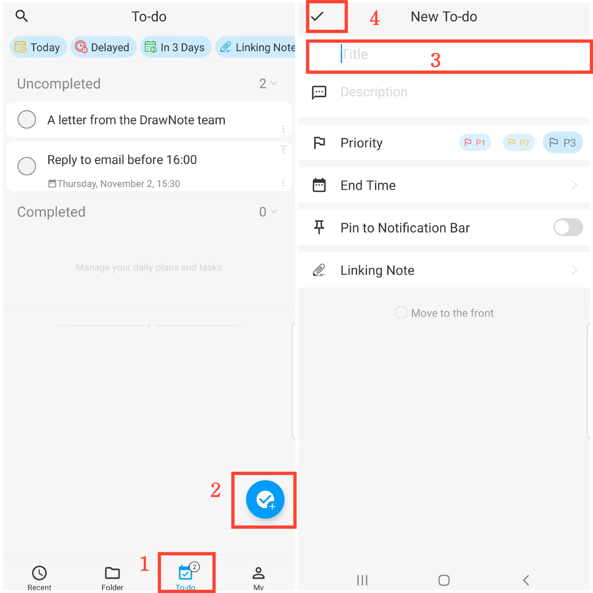
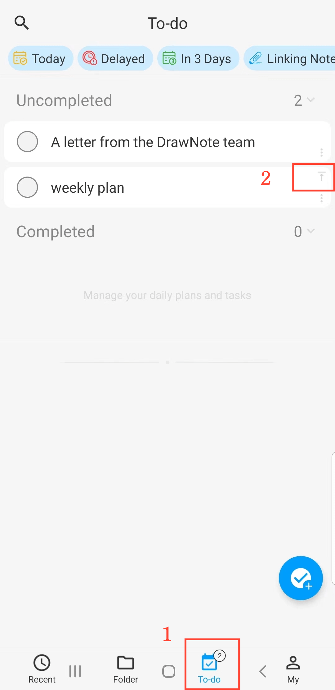
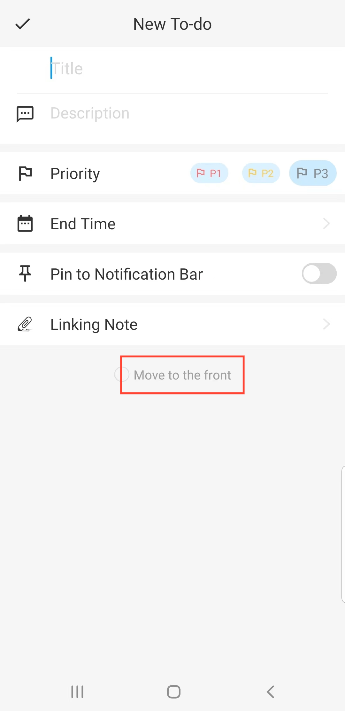

[Benutzerhandbuch](/dragonnest/drawnote/manual/de) > [Aufgabenliste](/dragonnest/drawnote/manual/de/to_do) >

Neues Aufgaben-Element erstellen
---
#### Schritte

1. Navigieren Sie zur 'Aufgaben'-Seite.

2. Klicken Sie auf die Schaltfläche "+".

3. Geben Sie Details wie den Titel, die Beschreibung und andere relevante Informationen ein.

4. Tippen Sie auf die Bestätigungsschaltfläche oben links, um ein neues Aufgaben-Element hinzuzufügen.

#### Hinweis
1. Aufgabenanzahl - Die Anzahl der ausstehenden Aufgaben wird in der unteren Registerkarte angezeigt.

2. Ein Aufgaben-Element anheften - Auf der Seite 'Aufgabenliste' tippen Sie auf die "Anheften"-Schaltfläche in der oberen rechten Ecke eines Elements, um wichtige Aufgaben nach oben zu verschieben.

3. Nach vorne verschieben - Im 'Neues To-do'-Bildschirm tippen Sie auf die Schaltfläche "Nach vorne verschieben" unten, um die Aufgabe ganz oben zu positionieren.

