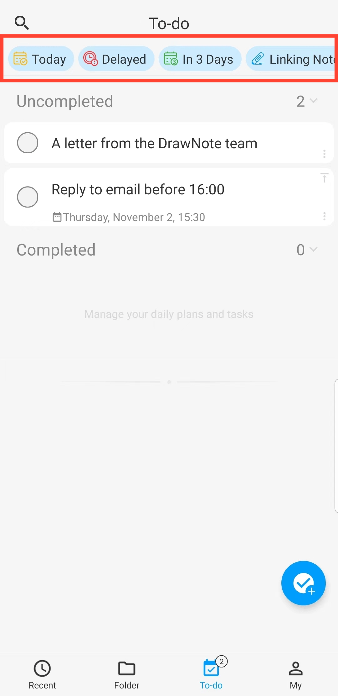

[User Manual](/dragonnest/drawnote/manual/en) > [To-Do List](/dragonnest/drawnote/manual/en/to_do) >

Aufgaben filtern
---
Auf der Seite "Aufgaben" können Sie Aufgaben nach Zeit, Priorität und zugehörigen Notizen filtern.

