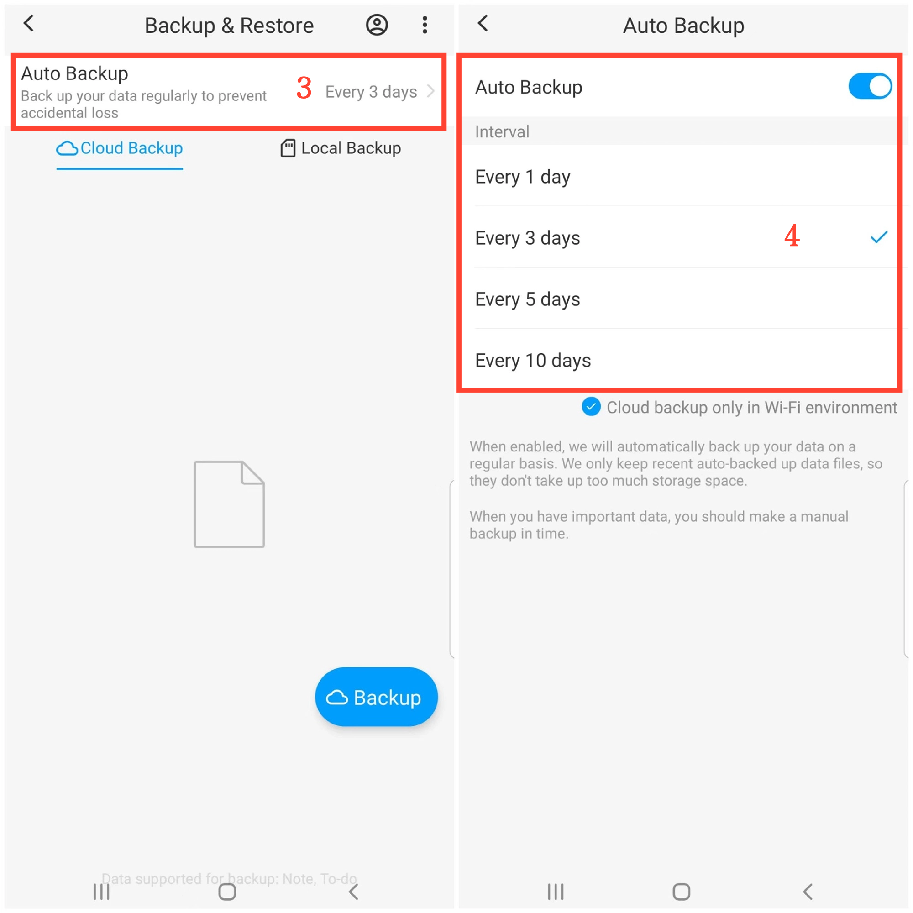

[User Manual](/dragonnest/drawnote/manual/en) > [Data Backup and Recovery](/dragonnest/drawnote/manual/en/data_backup_and_recovery) >

Auto Backup
---
#### Steps

1. Tap "My" on the main page.

2. Go to the "Backup & Restore" option.

3. Select the "Auto Backup" option.

4. Turn on the "Auto Backup" toggle and choose the backup interval. To safeguard your data and prepare for unforeseen circumstances.

