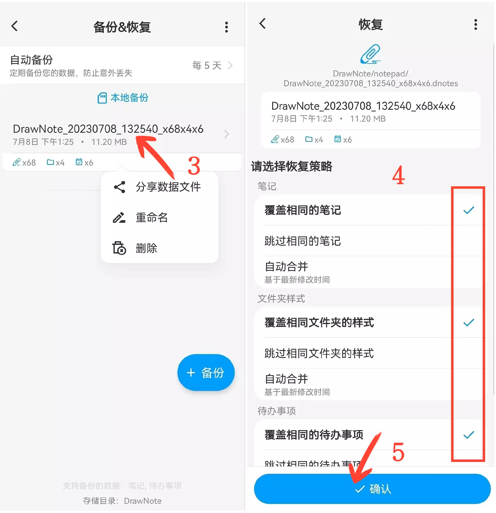

[User Manual](/dragonnest/drawnote/manual/en) > [Data Backup and Recovery](/dragonnest/drawnote/manual/en/data_backup_and_recovery) >

Data Recovery
---
#### Steps

1. Tap "My" on the main page.

2. Access the "Backup & Restore" option.

3. Click on a file entry to select a backup file.

4. Check the appropriate options.

5. Click "Confirm" to restore the data.

#### Tips
When recovering backup data, there are three strategies to choose from:

- Overwrite the same notes - Replace the current notes with the backup content.
- Skip the same notes - Keep the current notes unchanged when the backup content is the same.
- Automatically merge - Merge the backup and existing notes based on the latest modification time.

Choose the appropriate strategy based on your needs and regularly back up to prevent data loss.