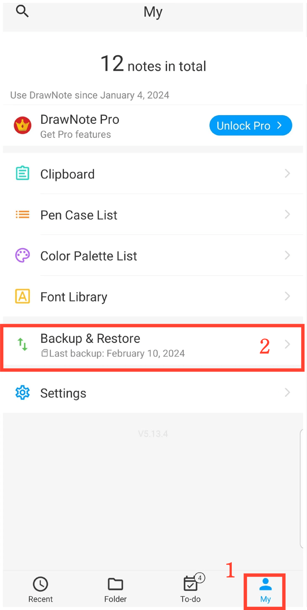

[User Manual](/dragonnest/drawnote/manual/en) >

Data Backup and Recovery
---

With the data backup and recovery feature, you can easily safeguard critical information and avoid unexpected loss.
You can choose between "cloud backup" or "local backup".
- [Data Backup](data_backup.md)

- [Automatic Backup](automatic_backup.md)

- [Data Recovery](data_recovery.md)

- [Manage Backup Data](manage_backup_data.md)

