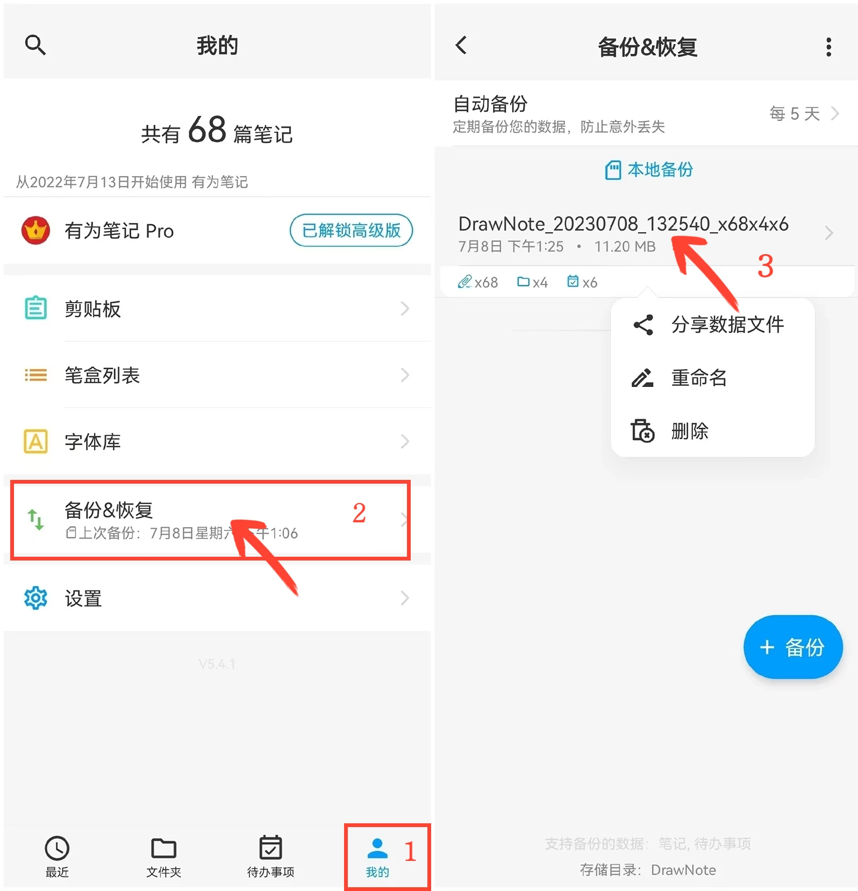

[User Manual](/dragonnest/drawnote/manual/en) > [Data Backup and Recovery](/dragonnest/drawnote/manual/en/data_backup_and_recovery) >

Manage Backup Data
---
#### Steps

1. Tap "My" on the main page.

2. Access the "Backup & Restore" option.

3. Long-press a file entry to manage data recovery items. You can perform sharing, renaming, and deletion operations.

