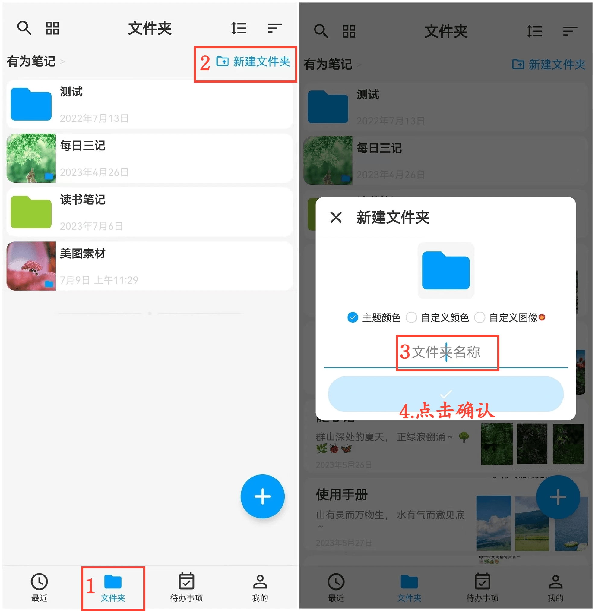

[User Manual](/dragonnest/drawnote/manual/en) > [Folder](/dragonnest/drawnote/manual/en/folder) >

Create New Folder
---
#### Steps

1. Tap "Folder" on the main page.

2. Click the "New Folder" button in the top right corner.

3. Enter the folder name.

4. Click the confirm button.

#### Tips
- You can choose the folder's color or customize the cover when creating or editing a folder.