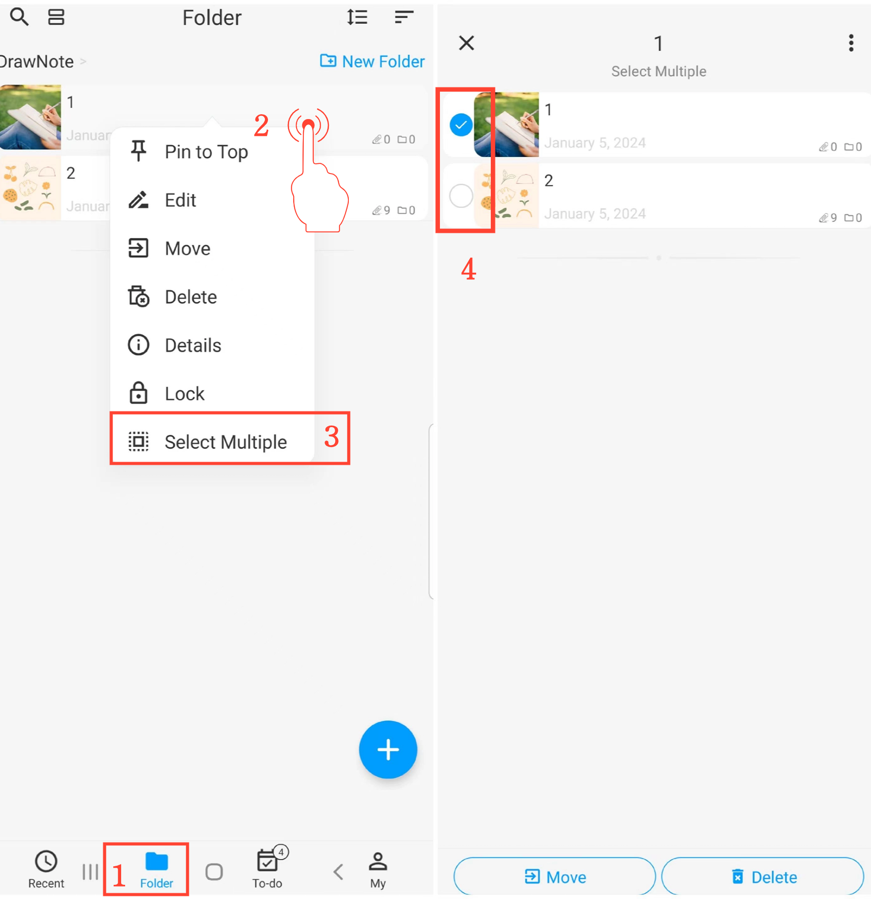

[User Manual](/dragonnest/drawnote/manual/en) > [Folder](/dragonnest/drawnote/manual/en/folder) >

Select Multiple Folders or Notes
---

#### Steps
1. On the "Folder" page, long-press a folder or note.

2. In the popup menu, click "Select Multiple" to enter multi-selection mode.

3. Choose the folders or notes you want to modify and perform batch actions such as moving or deleting.

