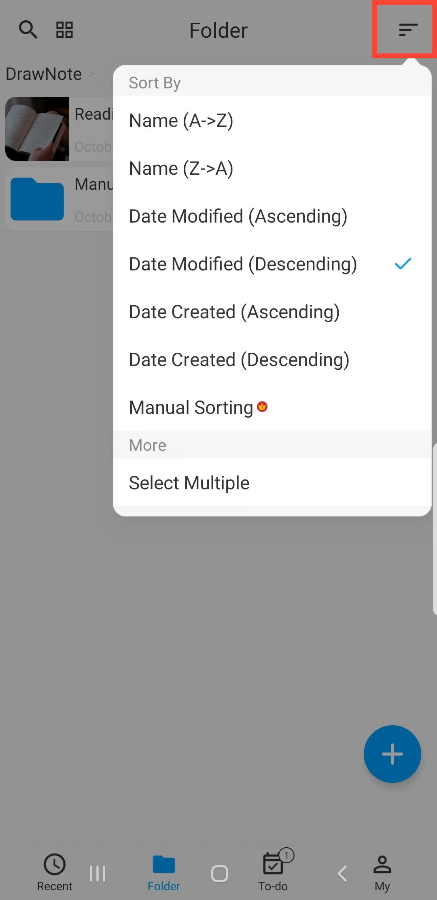
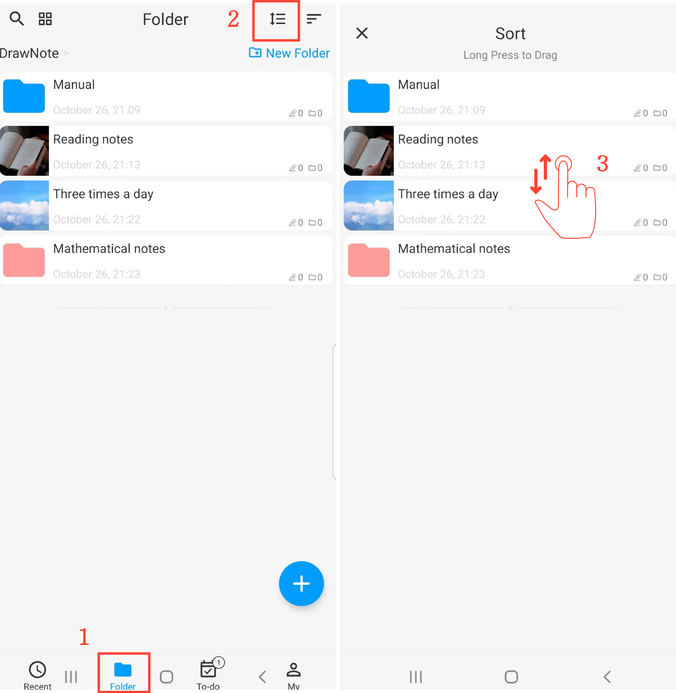

[User Manual](/dragonnest/drawnote/manual/en) > [Folder](/dragonnest/drawnote/manual/en/folder) >

Sort Folders
---
There are multiple ways to sort folders. You can sort them by Name, Date modified, Date Created, and more, or you can manually arrange them.

#### Select a Sorting Method
On the "Folder" page, click the "Sort By" button and choose your preferred sorting method.

#### Manual Sorting
1. On the "Folder" page.

2. Click the "Sort" button.

3. Long-press and drag folders up and down to adjust their order.

