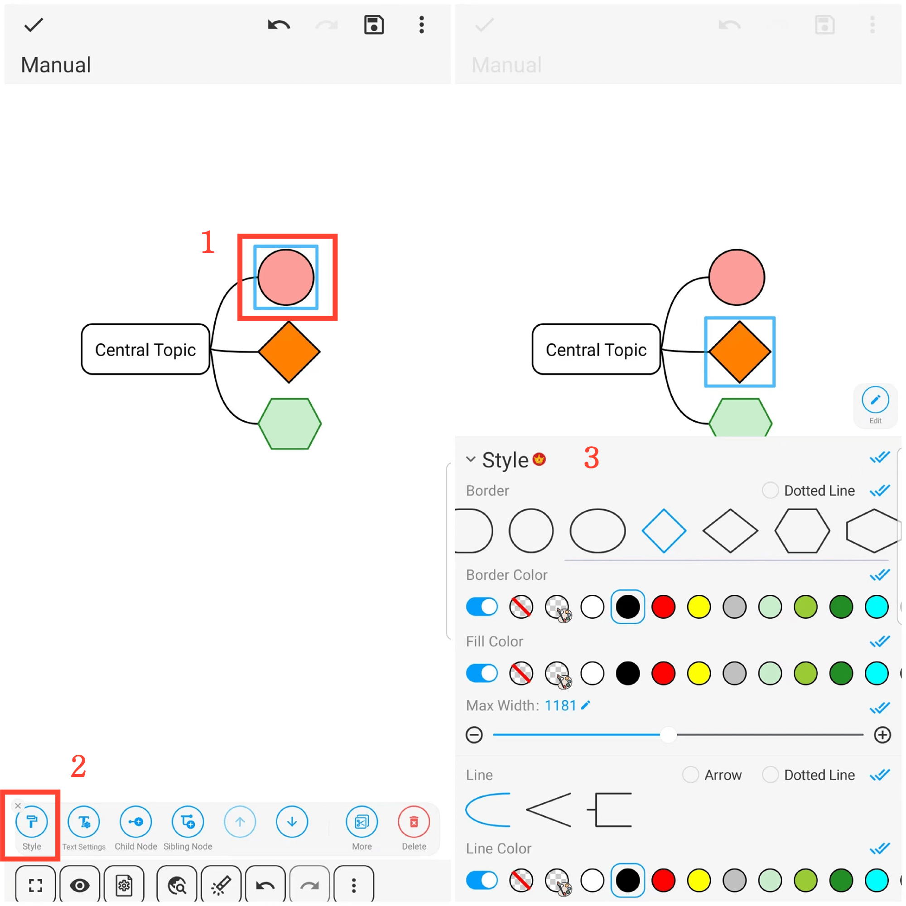

[User Manual](/dragonnest/drawnote/manual/en) > [Mind Mapping](/dragonnest/drawnote/manual/en/mind_mapping) >

Borders and Line Styles
---
#### Steps

1. Click on the node frame you want to set.

2. Click on the "Style" tab.

3. In the pop-up window, choose the desired style options, such as border shape, border color, fill color, line style, and line color.

#### Tips

Click the blue double checkmarks on the right to apply the style to child nodes, sibling nodes, or both sibling and child nodes.